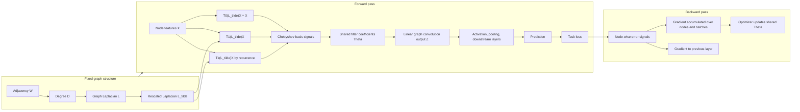

# P-GRAPH-001: Convolutional Neural Networks on Graphs with Fast Localized Spectral Filtering

## Citation

Michaël Defferrard, Xavier Bresson, and Pierre Vandergheynst.
Convolutional Neural Networks on Graphs with Fast Localized Spectral Filtering.
NeurIPS 2016.

## Reading Tier

Tier 0, Tier 1

## Track

Spatiotemporal modeling

## Template Alignment Map

This note was developed through an extended research-reading process before the full 18-section note template was standardized. Existing sections are preserved when they already express the required content clearly. The map below records how the current note corresponds to the standard template.

| Template Section | Current Note Location | Status |
| --- | --- | --- |
| 1. Citation | Paper metadata / reading status | Covered |
| 2. Reading Tier and Track | Paper metadata / research context | Covered |
| 3. Core Problem | Core problem / why graph CNN is needed | Covered |
| 4. Intuition Before the Math | Laplacian, Fourier, filtering intuition sections | Covered |
| 5. Mathematical or Algorithmic Setup | Graph Laplacian, graph Fourier transform, spectral filtering, Chebyshev sections | Covered |
| 6. Method: Step-by-Step Logic | Polynomial filters, Chebyshev recurrence, multi-feature graph convolution | Covered |
| 7. Key Equations and Derivations | Laplacian energy, spectral filtering, polynomial filters, Chebyshev recurrence | Covered |
| 8. Assumptions | Graph quality, locality, stationarity, PM2.5 graph validity discussions | Covered |
| 9. Experimental Evidence | Experiments and Graph Quality | Covered |
| 10. Limitations | Final summary / limitations / PM2.5 critique | Covered |
| 11. Research-Level Critique | Reliability critique and PM2.5 graph construction validation | Covered |
| 12. Connection to My Active Project | PM2.5 graph construction and reliability validation | Covered |
| 13. Transferable Intuitions | Key takeaways and final paper-level summary | Covered |
| 14. Implementation Implications | PM2.5 validation protocol and implementation-oriented critique | Partial |
| 15. Possible Research Questions | Reliability questions and PM2.5 transfer hypotheses | Partial |
| 16. What I Should Be Able to Explain After Reading | Add below if missing | Needs explicit checklist |
| 17. Follow-Up Actions | Add below if missing | Needs explicit actions |
| 18. Completion Criteria | Reading Status / completion note | Covered |

## Understanding Checklist

* Explain why ordinary convolution can be viewed as frequency-domain multiplication.
* Explain why Fourier coefficients are inner products with orthogonal basis vectors.
* Explain why graph convolution is hard to define directly in the node domain.
* Explain why variable degree, unordered neighbors, no local coordinate system, and permutation equivariance make CNN-style graph convolution difficult.
* Explain what graph frequency means and why it is defined by the Laplacian.
* Explain why arbitrary spectral filters are generally not localized.
* Explain why non-parametric spectral filters are not localized.
* Explain how polynomial filters create K-hop locality.
* Explain what the Chebyshev filter does in the node domain.
* Distinguish graph structure processing from node signal processing.
* Explain why the "frequency domain" in ChebNet means graph spectral domain, not temporal frequency.
* Explain why $U$ and $\Lambda$ come from the graph Laplacian, while $\mathbf{x}$ or $X$ are the node input data.
* Explain how $U^T\mathbf{x}$ projects a node signal onto graph Fourier modes.
* Explain why ChebNet introduces the spectral domain but computes filters through Chebyshev polynomials in the node domain.
* Explain how multi-feature graph convolution mixes input and output channels.
* Explain why graph coarsening is preprocessing rather than learned hierarchy in the original paper.
* Explain why graph quality is a reliability bottleneck.
* Explain how this paper motivates graph construction validation for PM2.5 forecasting.
* Explain what shared weights mean in ordinary convolution.
* Explain why shared weights are trainable rather than fixed.
* Explain how gradients for shared weights accumulate across all usages.
* Explain what the shared parameters are in ChebNet.
* Explain the forward pass of a Chebyshev graph convolution layer.
* Explain how backpropagation updates Chebyshev filter coefficients.
* Distinguish fixed graph-derived operators from trainable model parameters.
* Explain why graph quality remains a modeling assumption even after training.

## Why This Paper Matters

This paper is a foundation for understanding graph convolution before treating STGCN as a black-box forecasting baseline. It explains how convolution can be defined on an irregular graph by moving from the vertex domain to the spectral domain of the graph Laplacian, then makes that construction practical through localized polynomial filters.

The central contribution is not merely applying neural networks to graphs. The paper shows how to design graph filters that are:

* localized to a bounded graph neighborhood,
* efficient on sparse graphs,
* computable without explicit graph Fourier basis multiplication at every layer,
* parameterized by a small number of learnable coefficients.

For reliable PM2.5 forecasting, this matters because graph construction, Laplacian normalization, filter support size, and graph quality become modeling assumptions. If those assumptions are wrong, reliability failures may come from the graph rather than from the temporal forecasting architecture alone.

## Core Problem

Classical CNNs rely on regular grids. Pixels have a consistent local neighborhood structure, filters can be shared across locations, and translation-like operations are well defined. Graphs do not provide these conveniences. A node's neighbors are unordered, degrees vary across nodes, and there is no canonical spatial translation operator.

The paper addresses this by defining convolution through spectral graph theory. Instead of sliding a kernel over ordered neighborhoods, it filters graph signals through functions of the graph Laplacian. The main technical challenge is then to make this spectral definition localized and computationally scalable.

## Intuition Before the Math

On images, a convolutional filter can be reused because each local patch has the same grid geometry. A 3 by 3 image filter has a clear meaning everywhere: top-left, center, bottom-right, and so on. On a station graph, a node may have three neighbors, another may have twelve, and there is no natural order saying which neighbor is "left" or "right."

This is why a direct spatial generalization of CNN convolution is difficult. The paper avoids the missing neighbor ordering problem by moving to graph frequencies. The graph Laplacian plays the role of a geometry-aware operator: its eigenvectors define smooth-to-oscillatory modes over the graph. Filtering then means changing how much of each graph-frequency component is retained.

This move solves the conceptual definition problem, but not the engineering problem. Direct spectral filtering is expensive and not localized. The paper's key step is to restrict filters to polynomials of the Laplacian and approximate them with Chebyshev polynomials, which brings the operation back to sparse local message propagation.

## Mathematical Setup

Let the graph be:

```math
G=(V,E,W).
```

Here, $V$ is the node set, $E$ is the edge set, and $W$ is the weighted adjacency matrix. This is the paper's starting point for replacing regular-grid convolution with graph-domain filtering. In a PM2.5 station graph, nodes are monitoring stations and $W_{ij}$ records the chosen connection strength between stations $i$ and $j$.

A graph signal is:

```math
\mathbf{x}\in\mathbb{R}^n.
```

Each entry $x_i$ is a value attached to one graph node. This lets the paper treat graph data as a signal over vertices. In PM2.5 forecasting, $\mathbf{x}$ could represent pollution measurements across all monitoring stations at a fixed time.

The unnormalized graph Laplacian is:

```math
L=D-W.
```

Here, $D$ is the degree matrix and $W$ is the weighted adjacency matrix. This formula gives the paper the graph operator that measures local variation. In a PM2.5 station graph, $L$ encodes which station differences are treated as local disagreements under the selected graph.

The normalized graph Laplacian is:

```math
L=I_n-D^{-1/2}WD^{-1/2}.
```

Here, $I_n$ is the $n$ by $n$ identity matrix, and the degree normalization rescales adjacency by node connectivity. The paper uses the Laplacian because it encodes graph geometry. It penalizes differences between connected nodes, so its eigenvectors describe patterns ranging from smooth over the graph to rapidly varying across edges. For PM2.5, the choice between unnormalized and normalized $L$ changes how highly connected stations influence spatial filtering.

Because the Laplacian is symmetric for an undirected weighted graph, it can be decomposed as:

```math
L=U\Lambda U^T.
```

Here, $U$ contains the graph Fourier modes and $\Lambda$ contains the corresponding graph frequencies. This eigendecomposition is the bridge from graph geometry to spectral filtering in Section 2.1. For PM2.5, changing the station graph changes $L$, which changes $U$, $\Lambda$, and therefore the meaning of graph frequency.

The graph Fourier transform is:

```math
\hat{\mathbf{x}}=U^T\mathbf{x}.
```

Here, $\hat{\mathbf{x}}$ contains the coefficients of $\mathbf{x}$ in the Laplacian eigenbasis. The transform lets the paper describe filtering by graph frequency instead of by ordered neighborhoods. For station data, $\hat{x}_k$ says how much the PM2.5 field aligns with graph mode $\mathbf{u}_k$.

The inverse transform is:

```math
\mathbf{x}=U\hat{\mathbf{x}}.
```

This reconstructs the node-domain signal from graph Fourier coefficients. The role of this transform is analogous to classical Fourier analysis, but the basis is determined by the graph rather than by a regular grid. For PM2.5 forecasting, this means the graph construction determines the frequency geometry used by the spatial layer.

## Spectral Filtering

A graph signal can be filtered by:

```math
\mathbf{y}=g_\theta(L)\mathbf{x}=Ug_\theta(\Lambda)U^T\mathbf{x}.
```

This equation defines convolution-like filtering on a graph by using the Laplacian spectrum. It transforms the node signal $\mathbf{x}$ into graph-frequency space with $U^T$, modifies frequency components using $g_\theta(\Lambda)$, and reconstructs the filtered signal $\mathbf{y}$ with $U$. The filter is tied to the chosen graph because $L$, $U$, and $\Lambda$ all depend on $W$.

For forecasting, this matters because the graph defines which spatial patterns are considered smooth, local, or high-frequency. A distance graph, a correlation graph, and a meteorological graph can induce different notions of graph frequency. However, P-GRAPH-001 itself solves the graph-domain convolution definition and efficient localized filtering problem; suitability for spatiotemporal forecasting comes from later models that combine spatial graph convolution with temporal modeling.

## Clarification: Graph Structure Processing vs Node Signal Processing

The Mathematical Setup and Spectral Filtering sections already give the main formulas. The short clarification here is about what is graph structure and what is node data.

A common source of confusion is to describe the ChebNet transformation as "time domain to frequency domain." In this paper, the more accurate phrase is:

```text
node domain / vertex domain -> graph spectral domain / graph frequency domain
```

There is no regular time axis in a general graph. The "frequency" is defined by the graph Laplacian eigenbasis. Low graph frequencies correspond to graph signals that vary smoothly across connected nodes. High graph frequencies correspond to signals that change sharply across graph edges.

The important separation is:

1. the graph structure defines the geometry and the frequency basis;
2. the node signal is the data being expanded, filtered, and reconstructed on that graph-defined basis.

### Graph Structure Objects

These objects are determined by the graph, not by a particular input signal:

| Object | Comes From | Role |
| --- | --- | --- |
| `W` | graph edge weights | Encodes which nodes are connected and how strongly |
| `D` | degree matrix from `W` | Normalizes graph connectivity |
| `L` | graph Laplacian | Measures graph smoothness and defines the graph geometry |
| `U` | eigenvectors of `L` | Graph Fourier basis |
| `\Lambda` | eigenvalues of `L` | Graph frequencies |
| `\tilde{L}` | rescaled Laplacian | Makes Chebyshev approximation numerically stable |
| coarsening hierarchy | graph preprocessing | Defines multi-resolution graph structure for pooling |

### Node Signal Objects

These objects are the data living on the graph:

| Object | Comes From | Role |
| --- | --- | --- |
| `x` | one scalar feature over all nodes | A graph signal in node domain |
| `X` | multi-feature node input | Multiple graph signals or node feature channels |
| `U^T x` | projection of `x` onto graph Fourier basis | Graph spectral coefficients |
| `g_\theta(\Lambda)U^T x` | frequency-domain filtering | Amplifies or suppresses graph frequency components |
| `Ug_\theta(\Lambda)U^T x` | inverse transform after filtering | Filtered graph signal back in node domain |
| `T_k(\tilde{L})x` | Chebyshev recurrence applied to node signal | Efficient localized filtering without explicit eigendecomposition |

### Core Transformation

The graph Laplacian eigendecomposition is:

```math
L = U\Lambda U^\top
```

The graph Fourier transform of a node signal is:

```math
\hat{x} = U^\top x
```

The inverse transform is:

```math
x = U\hat{x}
```

A spectral graph filter is:

```math
y = Ug_\theta(\Lambda)U^\top x
```

This means:

```text
1. U^T x maps node-domain values into graph-frequency coefficients.
2. g_theta(Lambda) modifies the coefficients frequency by frequency.
3. U maps the filtered coefficients back to node-domain values.
```

ChebNet then avoids explicit eigendecomposition and explicit spectral transformation by approximating the filter with Chebyshev polynomials:

```math
Ug_\theta(\Lambda)U^\top x
\approx
\sum_{k=0}^{K-1}\theta_k T_k(\tilde{L})x
```

This is why the paper first introduces the graph spectral domain but later returns to a vertex-domain computation. The spectral view defines what graph convolution means; the Chebyshev view makes it localized, efficient, and implementable. See the Chebyshev Approximation section below for the computational form used by the layer.

The graph defines the frequency basis; the node signal is projected onto that basis; the filter changes the signal's graph-frequency components; Chebyshev polynomials make the same idea computable directly in the node domain.

## Review Anchor: Why Spectral Filtering Defines Graph Convolution and Chebyshev Gives Locality

This section is a review anchor for the conceptual bridge from ordinary convolution, to graph spectral filtering, to localized Chebyshev graph convolution.

### 1. User intuition, made precise

A useful intuition is that the frequency domain provides an orthogonal basis in which filtering can be described component by component. More precisely, the Fourier coefficient is an inner product between the signal and a basis vector, while convolution becomes pointwise multiplication after the Fourier transform.

Thus, the original-domain view and frequency-domain view are:

```text
Original-domain view:
    convolution is a structured weighted combination of neighboring signal values.

Frequency-domain view:
    filtering is independent reweighting of frequency components.
```

For graph convolution, this suggests a strategy: when node-domain convolution is hard to define because the graph has no regular local window, define the filter in the graph spectral domain and then map the result back to the node domain.

### 2. Ordinary convolution and frequency-domain multiplication

In ordinary signal processing, convolution in the original domain corresponds to multiplication in the frequency domain.

```math
\mathcal{F}(x*h)=\mathcal{F}(x)\cdot\mathcal{F}(h)
```

For a Fourier basis element, the coefficient of the signal is an inner product with that basis element:

```math
\hat{x}_\ell
=
\langle x,u_\ell\rangle
```

The key conceptual point is:

```text
The filter does not have to be described only as a moving local window.
It can also be described as a rule for changing each frequency component.
```

A smoothing filter, for example, can be understood in two equivalent ways:

```text
Original domain:
    average nearby values.

Frequency domain:
    preserve low-frequency trends and suppress high-frequency oscillations.
```

This is the conceptual bridge used by spectral graph convolution.

### 3. Why CNN-style convolution is difficult on graphs

A CNN kernel on an image is well-defined because every pixel has a shared local coordinate system. A 3-by-3 kernel can refer to positions such as left, right, up, down, and center.

For a graph node, the neighborhood is:

```math
\mathcal{N}(i)=\{j:(i,j)\in E\}
```

A naive CNN-like graph convolution would require assigning different parameters to ordered neighbor slots:

```math
y_i
=
\theta_1x_{j_1}
+
\theta_2x_{j_2}
+
\theta_3x_{j_3}
+\cdots
```

But this is not well-defined because:

```text
1. nodes have variable degree;
2. neighbors are unordered;
3. there is no canonical local coordinate system;
4. there is no translation operator that moves the same kernel across the graph;
5. the output should be permutation equivariant under node reindexing.
```

The permutation equivariance requirement can be written as:

```math
F(PWP^\top,Px)=PF(W,x)
```

where `P` is a permutation matrix. This means that renaming the nodes should only rename the output, not change the model's meaning.

A convolution that depends on arbitrary neighbor order violates this principle. This is why graph convolution cannot simply copy image convolution.

### 4. How spectral graph convolution avoids the definition problem

The spectral approach avoids arbitrary neighbor ordering by defining convolution through the graph Laplacian eigenbasis.

For an undirected graph, the graph Laplacian admits the eigendecomposition:

```math
L=U\Lambda U^\top
```

The graph Fourier transform of a node signal is:

```math
\hat{x}=U^\top x
```

The spectral graph filter is:

```math
y=Ug_\theta(\Lambda)U^\top x
```

This should be read as:

```text
1. U^T x projects node-domain values onto graph Fourier modes.
2. g_theta(Lambda) reweights those graph-frequency components.
3. U maps the filtered signal back to node-domain values.
```

The spectral domain therefore provides a clean definition of graph filtering without needing an ordered local window around each node.

### 5. What graph frequency means

Graph frequency is not temporal frequency. It is defined by the Laplacian eigenvalues and measures how rapidly a graph signal changes across connected nodes.

The graph smoothness energy is:

```math
x^\top Lx
=
\frac{1}{2}\sum_{i,j}W_{ij}(x_i-x_j)^2
```

Low graph frequencies correspond to smooth variation over connected nodes. High graph frequencies correspond to sharp variation across graph edges.

In a PM2.5 graph:

```text
Low graph frequency:
    region-level pollution trend.

High graph frequency:
    local spike, sensor noise, sharp spatial boundary, or localized pollution source.
```

### 6. Why spectral filtering alone is not enough

The spectral definition solves the definition problem, but it does not automatically solve locality.

If `g_theta(Lambda)` is an arbitrary diagonal matrix,

```math
g_\theta(\Lambda)
=
\mathrm{diag}(\theta_1,\theta_2,\ldots,\theta_n)
```

then the corresponding node-domain operator is:

```math
A=Ug_\theta(\Lambda)U^\top
```

and

```math
y=Ax
```

The matrix `A` is generally dense. Therefore, one node's output can depend on all nodes in the graph.

So the generic spectral filter defines a graph filter, but not necessarily a localized graph convolution.

### 7. How Laplacian polynomials create K-hop locality

ChebNet obtains locality by constraining the spectral filter to be a polynomial of the Laplacian eigenvalues:

```math
g_\theta(\Lambda)
=
\sum_{k=0}^{K-1}\theta_k\Lambda^k
```

Substituting this into the spectral filter gives:

```math
Ug_\theta(\Lambda)U^\top x
=
U
\left(
\sum_{k=0}^{K-1}\theta_k\Lambda^k
\right)
U^\top x
```

Using the eigendecomposition of `L`,

```math
U\Lambda^kU^\top=L^k
```

we obtain:

```math
Ug_\theta(\Lambda)U^\top x
=
\sum_{k=0}^{K-1}\theta_kL^kx
```

Since a multiplication by the graph operator propagates information by at most one graph step, a Laplacian polynomial whose highest power is K gives K-hop localized dependency. In the K-term notation above, the highest explicit power is K-1, so the support follows that convention.

The bridge is:

```text
spectral filter
-> polynomial spectral filter
-> polynomial of the graph Laplacian
-> K-hop localized node-domain computation
```

### 8. What the Chebyshev filter does in practice

ChebNet uses Chebyshev polynomials to compute this localized filter efficiently and stably.

The rescaled Laplacian is:

```math
\tilde{L}
=
\frac{2}{\lambda_{\max}}L-I_n
```

The Chebyshev filter is:

```math
y
=
\sum_{k=0}^{K-1}\theta_kT_k(\tilde{L})x
```

with recurrence:

```math
T_0(\tilde{L})x=x
```

```math
T_1(\tilde{L})x=\tilde{L}x
```

```math
T_k(\tilde{L})x
=
2\tilde{L}T_{k-1}(\tilde{L})x
-
T_{k-2}(\tilde{L})x
```

This avoids explicitly computing `U`, `Lambda`, or `U^T x`.

Thus:

```text
Spectral view:
    defines what a graph filter means.

Polynomial view:
    makes the filter localized.

Chebyshev view:
    makes the localized filter efficient and numerically stable.
```

### 9. Graph structure processing vs node signal processing

The detailed object-level split is in the preceding clarification section. The compact review distinction is:

| Category | Objects | Role |
| --- | --- | --- |
| Graph structure processing | `W`, `D`, `L`, `U`, `\Lambda`, `\tilde{L}` | Defines graph geometry, graph frequencies, and graph operators |
| Node signal processing | `x`, `X`, `U^T x`, `g_\theta(\Lambda)U^T x`, `T_k(\tilde{L})x` | Applies graph-defined filters to the actual node values or node features |
| Learnable filter parameters | `\theta_k` | Learn how to combine graph-frequency or polynomial components |
| Implementation pathway | Chebyshev recurrence | Computes localized filtering without eigendecomposition |

The graph defines the frequency basis and propagation geometry. The node signal is the data being projected, filtered, and reconstructed. The learnable parameters do not create the graph Fourier basis; they learn how to reweight graph-frequency or polynomial components.

### 10. One-sentence memory hook

Spectral filtering defines graph convolution; Laplacian polynomials give K-hop locality; Chebyshev recurrence makes the localized filter efficient in the node domain.

## Why Naive Spectral Filters Are Not Enough

A direct non-parametric spectral filter can be written as:

```math
g_\theta(\Lambda)=\mathrm{diag}(\theta).
```

Here, $\theta$ contains one learnable parameter per graph frequency. This formula solves the definitional problem of spectral filtering, but it is not a good scalable graph CNN layer. For PM2.5 station graphs, this would make the filter tightly dependent on the eigensystem of one constructed graph.

The problems are:

* It is not localized in the vertex domain, so a node's output may depend globally on many other nodes.
* It requires $O(n)$ learnable parameters for a graph with $n$ nodes.
* It requires expensive multiplication by the graph Fourier basis $U$.
* It depends tightly on a specific graph eigensystem, which makes the filter less operationally interpretable as local aggregation.

For PM2.5 forecasting, this is undesirable because local support should be an explicit assumption: the modeler should know whether a station aggregates from one-hop, two-hop, or broader graph neighborhoods.

## Polynomial Filters and K-Hop Locality

The paper replaces arbitrary spectral filters with polynomial filters of the Laplacian:

```math
g_\theta(L)=\sum_{k=0}^{K-1}\theta_k L^k.
```

Here, $\theta_k$ is the learnable coefficient for the $k$-th power of $L$, and $K$ controls the polynomial order. This is the paper's key move from a non-local spectral definition to localized graph filtering. The key fact is that powers of the Laplacian only mix information along graph paths up to a bounded length. A polynomial of order $K$ produces a filter localized within a $K$-hop neighborhood. If two nodes are farther apart than the filter support, the filter does not directly couple them.

This gives $K$ a concrete modeling meaning: $K$ controls graph-neighborhood support. In station graphs, $K$ should not be treated as a generic hyperparameter only. It is a locality assumption about how far spatial information should propagate through the graph. A larger $K$ may capture broader regional structure, but it may also propagate noise or misleading dependencies if the graph edges are poorly specified.

## Chebyshev Approximation

Polynomial filters still need to be computed efficiently. The paper uses Chebyshev polynomial approximation to avoid explicit eigendecomposition and Fourier-basis multiplication.

First, the Laplacian is rescaled:

```math
\tilde{L}=\frac{2}{\lambda_{\max}}L-I_n.
```

Here, $\lambda_{\max}$ is the largest eigenvalue of $L$, and $\tilde{L}$ is the rescaled Laplacian. This scaling puts the spectrum into a range suitable for Chebyshev recurrence. For PM2.5 station graphs, the scaling choice should be reproducible because it affects the numerical behavior of the graph convolution layer.

The filter is then written as:

```math
g_\theta(L)\mathbf{x}=\sum_{k=0}^{K-1}\theta_k T_k(\tilde{L})\mathbf{x}.
```

Here, $T_k$ is the Chebyshev polynomial of order $k$. This equation keeps the spectral-filtering interpretation while making the computation possible without explicitly multiplying by $U$. In PM2.5 forecasting, this is what makes sparse station-graph filtering practical.

The scalar recurrence is:

```math
T_0(z)=1,\quad T_1(z)=z,\quad T_k(z)=2zT_{k-1}(z)-T_{k-2}(z).
```

Here, $z$ is a scalar input to the Chebyshev polynomial. The recurrence lets the paper compute higher-order filter terms from two previous terms. This is the algebraic reason the graph filter can be implemented efficiently.

For graph signals, this becomes:

```math
\bar{\mathbf{x}}_0=\mathbf{x},\quad \bar{\mathbf{x}}_1=\tilde{L}\mathbf{x},\quad \bar{\mathbf{x}}_k=2\tilde{L}\bar{\mathbf{x}}_{k-1}-\bar{\mathbf{x}}_{k-2}.
```

Here, $\bar{\mathbf{x}}_k$ is the $k$-th recursively computed graph-filtered signal. The important implementation consequence is that each step only needs sparse matrix-vector multiplication by the scaled Laplacian. No explicit graph Fourier transform is needed during filtering. For station graphs, this ties runtime to sparse edges rather than dense spectral basis operations.

The resulting complexity is:

```math
O(K\lvert E\rvert).
```

Here, $K$ is the filter support size and $|E|$ is the number of graph edges. This is efficient when the graph is sparse. If the station graph is dense or poorly sparsified, this computational advantage weakens and the locality assumption becomes harder to interpret.

## Multi-Feature Graph Convolutional Layer

### 1. From One Graph Signal to Multiple Feature Maps

The previous filtering discussion considered a single graph signal:

```math
\mathbf{y}=g_\theta(L)\mathbf{x},
```

where:

```math
\mathbf{x}\in\mathbb{R}^n
```

and:

```math
\mathbf{y}\in\mathbb{R}^n.
```

This means one input feature value per node is transformed into one output feature value per node. The node set is unchanged; only the value attached to each node is filtered.

A neural network layer usually has multiple input feature maps and multiple output feature maps. For sample $s$, let:

```math
\mathbf{x}_{s,i}\in\mathbb{R}^n
```

be the $i$-th input feature map, where:

```math
i=1,\ldots,F_{\mathrm{in}}.
```

The input feature matrix for sample $s$ can therefore be written as:

```math
\mathbf{X}_s= \left[ \mathbf{x}_{s,1}, \mathbf{x}_{s,2}, \ldots, \mathbf{x}_{s,F_{\mathrm{in}}} \right] \in\mathbb{R}^{n\times F_{\mathrm{in}}}.
```

Formula (5) in the paper defines the $j$-th output feature map as:

```math
\mathbf{y}_{s,j} = \sum_{i=1}^{F_{\mathrm{in}}} g_{\theta_{i,j}}(L)\mathbf{x}_{s,i},
```

where:

```math
j=1,\ldots,F_{\mathrm{out}}.
```

Thus, each output channel is obtained by filtering all input channels and summing their contributions.

### 2. Chebyshev Expansion of Formula (5)

Using Chebyshev filters, each input-output channel filter is expanded as:

```math
g_{\theta_{i,j}}(L)\mathbf{x}_{s,i} = \sum_{k=0}^{K-1} \theta_{i,j,k}T_k(\tilde L)\mathbf{x}_{s,i}.
```

Substituting this expansion into formula (5) gives:

```math
\mathbf{y}_{s,j} = \sum_{i=1}^{F_{\mathrm{in}}} \sum_{k=0}^{K-1} \theta_{i,j,k}T_k(\tilde L)\mathbf{x}_{s,i}.
```

The indices have the following meanings:

* $i$: input feature channel index;
* $j$: output feature channel index;
* $k$: Chebyshev basis or polynomial order index.

The learnable parameter $\theta_{i,j,k}$ specifies how much the $k$-th Chebyshev-filtered version of input channel $i$ contributes to output channel $j$.

For one fixed pair $(i,j)$, the filter has $K$ Chebyshev coefficients:

```math
\theta_{i,j,0},\theta_{i,j,1},\ldots,\theta_{i,j,K-1}.
```

There are $F_{\mathrm{in}}F_{\mathrm{out}}$ input-output channel pairs. Therefore, the number of learnable parameters in this graph convolutional layer is:

```math
K F_{\mathrm{in}}F_{\mathrm{out}}.
```

### 3. Why the Layer Sums Over Input Channels

The summation over input channels is analogous to standard multi-channel CNN convolution. In a CNN, one output channel is produced by applying kernels to all input channels and summing the results. Similarly, in graph convolution, one output graph feature map is produced by graph-filtering all input graph feature maps and summing their contributions.

The summation is a linear algebra operation, not a probabilistic assumption. It does not assume that input channels are statistically independent. The input channels may be correlated, redundant, causally related, or jointly shifted. Formula (5) only says that the layer forms a learned linear combination of filtered input features.

The component-level expression makes this clearer. For node $v$:

```math
y_{s,j}(v) = \sum_{i=1}^{F_{\mathrm{in}}} \sum_{k=0}^{K-1} \theta_{i,j,k} \left[T_k(\tilde L)\mathbf{x}_{s,i}\right]_v.
```

This is a sum of filtered feature values at the same output node coordinate $v$. The layer learns how much each input channel and each Chebyshev order should contribute through the parameters $\theta_{i,j,k}$.

However, within one linear graph convolutional layer, cross-channel interaction is linear before any nonlinear activation. More complex interactions among variables require nonlinear activations, deeper layers, temporal modules, attention, gating, or explicitly designed interaction features.

### 4. Output Channels Are Not Independent Random Variables

The output channels:

```math
\mathbf{y}_{s,1},\mathbf{y}_{s,2},\ldots,\mathbf{y}_{s,F_{\mathrm{out}}}
```

are different learned feature maps. They are not assumed to be statistically independent random variables.

Each output channel has its own set of parameters:

```math
\theta_{i,j,k}.
```

Therefore, different output channels can learn different graph-structured feature detectors. For example, one output channel may emphasize smooth low-frequency station patterns, while another may emphasize sharper local contrasts, depending on the learned Chebyshev coefficients.

However, the channels are jointly trained under the same loss and can be mixed again by later layers. A better interpretation is that output channels are learned coordinates of a hidden node representation, not independent factors.

### 5. Why Each Output Channel Remains a Node Signal

For a fixed sample $s$ and output channel $j$:

```math
\mathbf{y}_{s,j}\in\mathbb{R}^n.
```

This is because graph convolution changes node features, not the node set. For each input channel:

```math
\mathbf{x}_{s,i}\in\mathbb{R}^n.
```

Since $T_k(\tilde L)$ is an $n$ by $n$ graph operator:

```math
T_k(\tilde L)\mathbf{x}_{s,i}\in\mathbb{R}^n.
```

Multiplying by $\theta_{i,j,k}$ keeps the result in $\mathbb{R}^n$, and summing vectors over $i$ and $k$ still gives a vector in $\mathbb{R}^n$. Therefore:

```math
\mathbf{y}_{s,j} = \sum_{i=1}^{F_{\mathrm{in}}} \sum_{k=0}^{K-1} \theta_{i,j,k}T_k(\tilde L)\mathbf{x}_{s,i} \in\mathbb{R}^n.
```

The full layer maps:

```math
\mathbf{X}_s\in\mathbb{R}^{n\times F_{\mathrm{in}}}
```

to:

```math
\mathbf{Y}_s\in\mathbb{R}^{n\times F_{\mathrm{out}}}.
```

The number of nodes $n$ remains the same. What changes is the feature dimension attached to each node.

### 6. PM2.5 Forecasting Interpretation

For PM2.5 forecasting, input channels may include:

* PM2.5 concentration;
* temperature;
* humidity;
* wind speed;
* wind direction encoding;
* pressure;
* other pollutant variables;
* historical lag features.

Each input channel is a graph signal over monitoring stations. The graph convolutional layer applies localized graph filters to each variable and combines them into hidden node features.

For example, one output channel may combine:

* local PM2.5 spatial patterns;
* wind-related spatial transport patterns;
* humidity-related modulation patterns;
* station-level anomaly patterns.

These meanings are not guaranteed by the architecture, but they provide possible interpretations to test through experiments.

For STGCN-style models, this is the spatial part of the architecture: graph convolution mixes information across stations, while temporal convolution handles time dynamics. Understanding this separation is important because a forecasting failure may come from temporal modeling, graph construction, or their interaction.

## Reliability Risks of Multi-Feature Graph Convolution

### 1. The Main Risk: Shared Graph Geometry Across Variables

Formula (5) mixes multiple input feature channels through the same graph Laplacian:

```math
\mathbf{y}_{s,j} = \sum_{i=1}^{F_{\mathrm{in}}} \sum_{k=0}^{K-1} \theta_{i,j,k}T_k(\tilde L)\mathbf{x}_{s,i}.
```

This means that every input variable is filtered through the same graph geometry before being combined into output channels.

This is a strong assumption. In PM2.5 forecasting, PM2.5 concentration, temperature, humidity, wind speed, wind direction, pressure, and other pollutants may not share the same spatial mechanism.

A graph that is suitable for PM2.5 concentration may not be suitable for wind, humidity, or temperature. Therefore, the layer may propagate different variables through an inappropriate neighborhood structure.

The original reliability implication still applies: if the graph construction is wrong, then every variable is propagated through a potentially wrong neighborhood structure. Multi-feature graph convolution makes this more serious because the wrong graph can affect not just the target pollutant channel, but all environmental covariates that are filtered and then mixed.

### 2. Channel Noise and Missingness Can Be Propagated

If an input channel contains sensor noise, missing values, station outage, or spike anomalies, graph filtering can spread that local corruption to nearby nodes.

The operation:

```math
T_k(\tilde L)\mathbf{x}_{s,i}
```

does not only use the original value at each node. It creates graph-local features up to $k$ hops. Therefore, a corrupted value in one station can affect a neighborhood of stations after filtering.

A simple perturbation view makes the risk explicit. If input channel $i$ is corrupted by a noise vector $\mathbf{e}_{s,i}$, then the filtered term changes by:

```math
T_k(\tilde L)(\mathbf{x}_{s,i}+\mathbf{e}_{s,i}) - T_k(\tilde L)\mathbf{x}_{s,i} = T_k(\tilde L)\mathbf{e}_{s,i}.
```

After channel mixing, the contribution of this corruption to output channel $j$ is:

```math
\sum_{k=0}^{K-1} \theta_{i,j,k}T_k(\tilde L)\mathbf{e}_{s,i}.
```

Thus, graph convolution may transform local data-quality problems into spatially distributed representation errors. Missingness is especially risky if it is encoded as a value or imputed without an explicit missingness indicator, because the graph filter may treat the imputed pattern as a real graph signal.

### 3. Channel Mixing Can Hide the Source of Failure

The output channel is a sum over both input variables and Chebyshev orders:

```math
\mathbf{y}_{s,j} = \sum_{i=1}^{F_{\mathrm{in}}} \sum_{k=0}^{K-1} \theta_{i,j,k}T_k(\tilde L)\mathbf{x}_{s,i}.
```

If the final prediction fails, it may be unclear whether the cause is:

* wrong graph construction;
* wrong support size $K$;
* noisy PM2.5 observations;
* unstable meteorological variables;
* missingness in one input channel;
* spurious correlation learned during training;
* inappropriate use of the same graph for all variables.

Thus, multi-feature graph convolution increases representation capacity, but it also creates coupled failure modes. The learned output channel can look smooth and useful while hiding the fact that one input channel or one graph-filtered order is carrying unstable information.

This is why final prediction error alone is not enough. A model can achieve low validation RMSE while relying on a graph-filtered channel that becomes unreliable under seasonal shift, station outage, or changing wind regimes.

### 4. Spurious Spatial-Channel Shortcuts

The model may learn that a certain graph-filtered variable is predictive in the training distribution.

For example, humidity or wind speed may be strongly correlated with PM2.5 in one season or region. The model may learn large coefficients for these filtered channels:

```math
\theta_{i,j,k}\quad \text{large for a shifted or unstable channel }i.
```

However, under temporal shift, seasonal change, extreme weather, or region transfer, the same relationship may break down.

Therefore, the model may rely on spatial-channel shortcuts that perform well under standard validation but fail under distribution shift. The risk is not only that a raw variable is spuriously correlated with PM2.5. The stronger risk is that a graph-filtered version of that variable becomes spuriously predictive because the graph has spread the shortcut across neighboring stations.

### 5. Output Channels Are Not Physical Mechanisms

The output feature maps:

```math
\mathbf{y}_{s,1},\ldots,\mathbf{y}_{s,F_{\mathrm{out}}}
```

are learned hidden representation coordinates. They should not be directly interpreted as physical mechanisms such as pollution transport, regional background pollution, or local anomaly propagation.

A single output channel may mix multiple variables and multiple Chebyshev orders:

```math
\mathbf{y}_{s,j} = \sum_{i=1}^{F_{\mathrm{in}}} \sum_{k=0}^{K-1} \theta_{i,j,k}T_k(\tilde L)\mathbf{x}_{s,i}.
```

Therefore, output channels require additional analysis before assigning physical meaning. Useful tools include:

* input channel ablation;
* graph perturbation;
* support-size sensitivity;
* feature corruption tests;
* representation similarity analysis;
* attribution or gradient-based analysis;
* shift-conditioned evaluation.

The safe interpretation is that output channels are learned coordinates of hidden node representations. Physical interpretation requires evidence beyond the architecture.

### 6. Critical Questions and Research Answers

#### Question 1: Should all variables use the same graph Laplacian?

Not necessarily. Different variables may have different spatial mechanisms.

A reliable PM2.5 forecasting study should compare different graph constructions, such as distance-based graphs, correlation-based graphs, meteorology-informed graphs, dynamic graphs, or variable-specific graphs.

The key question is not only which graph gives the lowest error, but which graph remains stable under shift and corruption.

#### Question 2: Does channel mixing model physical interactions sufficiently?

Not fully. A standard graph convolutional layer performs linear channel mixing before nonlinear activation.

This does not directly model complex multiplicative or conditional interactions, such as wind direction modulating pollution transport.

More expressive mechanisms may require nonlinear stacking, temporal modules, attention, gating, dynamic graphs, or explicitly constructed interaction features.

#### Question 3: Is a larger filter support always better?

No. A larger $K$ allows longer graph-hop propagation, but it can also mix unrelated stations, amplify graph mismatch, and propagate corrupted channels farther.

Therefore, $K$ should be evaluated not only by prediction error, but also by robustness, calibration, coverage, and downstream decision cost.

#### Question 4: Can graph convolution propagate missingness or sensor anomalies?

Yes. A noisy or missing value in one input channel may affect graph-filtered representations within the $K$-hop neighborhood.

This motivates missingness-aware evaluation, channel-specific corruption tests, and robust graph filtering protocols.

#### Question 5: Are output channels interpretable?

Not directly. They are learned representation coordinates, not independent physical factors.

Interpretability requires empirical validation through ablation, perturbation, representation analysis, and comparison across graph constructions and shift conditions.

#### Question 6: Can a good validation score hide a graph-channel failure?

Yes. Standard validation can reward a shortcut if the validation split shares the same seasonal, spatial, or sensor conditions as training.

A stronger evaluation should test temporal shift, station holdout, corrupted channels, alternative graphs, and forecast-to-decision outcomes. Otherwise, a model may look accurate while its graph-filtered hidden representation is brittle.

### 7. PM2.5 Reliability Protocol Implications

Formula (5) motivates the following reliability experiments:

| Risk | Possible Experiment |
| ---- | ------------------- |
| Same graph may not fit all variables | Compare distance, correlation, meteorology-informed, dynamic, and variable-specific graphs |
| Channel shortcut learning | Input-channel ablation and channel corruption |
| Noise propagation | Sensor spike, bias, and missingness stress tests |
| Over-large support size | $K$-sensitivity under clean and shifted conditions |
| Hidden representation instability | Representation similarity across shifts |
| Clean error hides decision failure | Forecast-to-decision evaluation |
| Static graph misses dynamic transport | Static graph vs dynamic graph comparison |

Therefore, reliable spatiotemporal forecasting should not only evaluate final prediction error. It should also examine:

* sensitivity to graph construction;
* sensitivity to the support size $K$;
* channel contribution under shift;
* calibration and coverage degradation;
* downstream decision cost;
* whether graph-filtered variables remain meaningful under missingness and noise.

The key research implication is:

Multi-feature graph convolution does not merely propagate PM2.5. It propagates and mixes all input variables under the same graph-defined geometry. Its reliability depends on whether that graph geometry remains valid for the variables, time periods, and shift conditions being modeled.

## Research Extension: Channel-Specific and Dynamic Graph Structures

This section is a research extension motivated by formula (5). It should not be read as a contribution that the original paper already completes. The paper gives the fast localized graph convolution layer; the following discussion asks what reliability questions arise when that layer is used for multi-variable PM2.5 forecasting.

### 1. Shared Node Set Does Not Imply Shared Graph Geometry

In environmental forecasting, different input variables may be observed on the same set of monitoring stations. Therefore, they share the same node set.

However, sharing the same node set does not imply that all variables should share the same graph Laplacian.

PM2.5 concentration, temperature, humidity, wind speed, wind direction, pressure, and other pollutant variables may follow different spatial mechanisms. A graph that is appropriate for PM2.5 transport may not be appropriate for temperature smoothing or wind-driven propagation.

Thus, the shared Laplacian in formula (5) should be interpreted as a modeling assumption, not a mathematical necessity.

### 2. Channel-Specific Graph Laplacians

A direct extension is to assign each input channel its own graph Laplacian:

```math
L_i.
```

Then the multi-feature graph convolution becomes:

```math
\mathbf{y}_{s,j} = \sum_{i=1}^{F_{\mathrm{in}}} \sum_{k=0}^{K-1} \theta_{i,j,k}T_k(\tilde L_i)\mathbf{x}_{s,i}.
```

Here, each input variable is filtered through its own graph geometry before being combined into the output channel.

This is mathematically valid as long as all graph Laplacians are defined over the same node set. Each $L_i$ is still an $n$ by $n$ matrix, so:

```math
T_k(\tilde L_i)\mathbf{x}_{s,i}\in\mathbb{R}^n.
```

Each filtered term remains an $n$-dimensional node signal, so the filtered results can still be summed or concatenated across channels.

The reliability advantage is that graph-channel mismatch may be reduced. The risk is that the model now depends on multiple graph constructions, each of which must be justified and evaluated.

### 3. Multi-Graph Mixture

Instead of assigning one graph per channel, one can define a set of candidate graphs:

```math
L^{(1)},L^{(2)},\ldots,L^{(R)}.
```

These may represent distance-based, correlation-based, meteorology-informed, learned, or dynamic graph structures.

A mixture version can be written as:

```math
\mathbf{y}_{s,j} = \sum_{i=1}^{F_{\mathrm{in}}} \sum_{r=1}^{R} \sum_{k=0}^{K-1} \alpha_{i,r} \theta_{i,j,r,k} T_k(\tilde L^{(r)})\mathbf{x}_{s,i}.
```

The coefficient $\alpha_{i,r}$ represents how strongly input channel $i$ uses graph relation $r$. A constrained mixture can require:

```math
\alpha_{i,r}\ge 0, \qquad \sum_{r=1}^{R}\alpha_{i,r}=1.
```

This approach allows each variable to combine several graph geometries rather than being forced to use one shared graph.

A dynamic version may use:

```math
\alpha_{i,1,t},\ldots,\alpha_{i,R,t} = \mathrm{softmax}(f_\phi(\mathbf{z}_t)),
```

so that graph-relation weights change with time, meteorological conditions, or regime.

### 4. Learned and Dynamic Graphs

A more flexible extension is to learn the graph structure itself.

For each channel, one may define:

```math
W_i=f_\phi(\text{node features},\text{distance},\text{historical statistics}),
```

and then construct:

```math
L_i=I_n-D_i^{-1/2}W_iD_i^{-1/2}.
```

For dynamic propagation, the graph may vary over time:

```math
W_{i,t}=f_\phi(\text{meteorology}_t,\text{station embeddings},\text{distance}),
```

with:

```math
L_{i,t}=I_n-D_{i,t}^{-1/2}W_{i,t}D_{i,t}^{-1/2}.
```

Then filtering can use:

```math
T_k(\tilde L_{i,t})\mathbf{x}_{t,i}.
```

Here, $D_i$ and $D_{i,t}$ are the degree matrices associated with $W_i$ and $W_{i,t}$. This allows the spatial propagation structure to depend on time, variable type, or meteorological regime.

However, learned graphs must be constrained. Otherwise, the model may learn spurious shortcuts rather than physically meaningful propagation structure.

Useful constraints include:

* nonnegative edge weights;
* sparsity;
* no self-loops unless explicitly intended;
* symmetry when using Chebyshev Laplacians;
* closeness to physical or distance-based priors;
* temporal smoothness for dynamic graphs;
* top-$k$ neighbor masks;
* prevention of future-information leakage.

### 5. Propagated Signals vs Propagation Modifiers

Not all input variables should necessarily be treated as graph signals to be propagated in the same way.

Some variables are propagated signals. For example:

* PM2.5 concentration;
* other pollutant concentrations;
* possibly temperature or humidity under some assumptions.

Other variables may be better interpreted as propagation modifiers. For example, wind direction and wind speed may determine how pollution should move between stations. They may be more appropriate as edge-weight generators or dynamic graph conditions rather than ordinary node channels filtered by a fixed $L$.

This distinction is important for PM2.5 forecasting:

* PM2.5 is the target signal being transported or spatially correlated;
* meteorological variables may modulate the graph structure through which PM2.5 propagates.

Therefore, reliable model design should distinguish between variables that should be filtered as signals and variables that should condition the graph itself.

### 6. Research Question

This extension leads to a concrete research question:

Does using a single shared graph Laplacian for all input variables create unreliable spatial-channel mixing under distribution shift?

More specific questions include:

* Does a shared graph perform well on clean validation but fail under temporal shift?
* Do channel-specific graphs reduce graph-channel mismatch?
* Do multi-graph mixtures improve calibration and robustness?
* Do dynamic graphs better capture wind-driven or season-dependent propagation?
* Do learned graphs improve reliability, or do they mainly learn training shortcuts?
* How do different graph designs affect uncertainty coverage and downstream decision cost?

### 7. Suggested Model Ladder

A rigorous research path should avoid jumping directly to the most flexible learned dynamic graph.

A better ladder is:

| Level | Model class | Purpose |
| ----- | ----------- | ------- |
| Level 0 | Shared static graph | Baseline; all variables share one $L$ |
| Level 1 | Channel-specific static graphs | Test whether variables need different graph geometries |
| Level 2 | Multi-graph mixture | Let channels combine several graph relations |
| Level 3 | Dynamic or learned graphs | Let graph structure depend on time, context, or meteorology |

The reliability question should be:

Does added graph flexibility improve robustness, calibration, and decision quality, or does it only improve clean prediction error?

### 8. Reliability Evaluation

The following evaluations are necessary:

| Risk | Evaluation |
| ---- | ---------- |
| Shared graph may not fit all variables | Compare shared vs channel-specific graphs |
| Learned graph may overfit | Graph perturbation and shift tests |
| Dynamic graph may leak future information | Time-safe construction audit |
| Channel-specific graph may increase complexity | Ablation and parameter sensitivity |
| Graph flexibility may only improve clean error | Calibration, coverage, and decision cost comparison |
| Wrong graph may propagate wrong information | Missingness, spike, and graph-mismatch stress tests |

The final research-level interpretation is:

Shared graph convolution assumes that all input variables share the same spatial dependency geometry. This is often unrealistic in environmental forecasting. A reliability-oriented model should distinguish signal-specific graphs, relation-specific graphs, and dynamic condition-dependent graphs, while testing whether increased graph flexibility improves robustness rather than merely clean accuracy.

## Graph Coarsening and Pooling

The paper also proposes graph coarsening and pooling through multilevel clustering. This is a separate design component from spectral filtering: graph convolution defines how features are transformed on a graph level, while coarsening and pooling define how the model moves to a lower-resolution graph level.

For my PM2.5 station-level forecasting baseline, this part should be treated carefully. It is useful for understanding the paper's CNN-like hierarchy, but it is not automatically suitable for node-level forecasting where every original station still needs a prediction.

### 1. What Pooling Means in Image CNNs

Pooling in image CNNs aggregates local feature responses over a small regular region, such as a 2 by 2 window. It usually does not learn new parameters. Convolution learns feature detectors; pooling aggregates the resulting feature responses.

For max pooling, the strongest activation in a local window is kept. This reduces spatial resolution, increases the effective receptive field of later layers, and makes local feature responses more stable to small shifts.

For example:

```math
\begin{bmatrix} 1 & 3 \\ 2 & 0 \end{bmatrix} \rightarrow 3
```

This means the local region contains a strong feature response, so the max-pooled representation keeps that response while discarding precise within-window location.

The reason image pooling is natural is that pixels live on a regular grid. A 2 by 2 block has an unambiguous spatial meaning.

### 2. Why Graphs Cannot Directly Use 2 by 2 Pooling

Graphs do not have a natural grid order. Node indices do not define spatial adjacency. Node 3 and node 4 may be adjacent in memory but unrelated on the graph, while node 3 and node 19 may be strongly connected.

Graph nodes also have variable degrees. One node may have two neighbors, while another may have twenty. Therefore, graph pooling cannot simply group consecutive node indices. It first needs a graph coarsening procedure to decide which nodes form meaningful local groups.

The key distinction is:

Image pooling receives local blocks from the grid. Graph pooling must first construct local groups from the graph.

### 3. Coarsening vs Pooling

Graph coarsening handles graph structure. It decides which fine-level nodes should be merged, what the next coarser graph is, how coarse-level edge weights are constructed, and which graph Laplacian will be used at the next layer.

Graph pooling handles node features. If the current hidden representation is:

```math
H^{(l)}\in\mathbb{R}^{n_l\times F_l}
```

then pooling produces a lower-resolution feature matrix:

```math
H^{(l+1)}\in\mathbb{R}^{n_{l+1}\times F_l}
```

The important distinction is:

* coarsening changes $G_l$, $W_l$, and $L_l$;
* pooling changes $H^{(l)}$;
* graph convolution transforms features on a fixed graph level.

Thus, graph coarsening produces the structural hierarchy, while graph pooling applies that hierarchy to feature maps during the forward pass.

### 4. Graclus Matching and the Coarsening Criterion

The paper uses the coarsening phase of the Graclus multilevel clustering algorithm. At each coarsening level, Graclus uses a greedy matching rule.

It chooses an unmarked node $i$ and matches it with one unmarked neighbor $j$ that maximizes:

```math
W_{ij}\left(\frac{1}{d_i}+\frac{1}{d_j}\right)
```

where:

```math
d_i=\sum_q W_{iq}
```

is the weighted degree of node $i$.

Expanding the score gives:

```math
W_{ij}\left(\frac{1}{d_i}+\frac{1}{d_j}\right)=\frac{W_{ij}}{d_i}+\frac{W_{ij}}{d_j}
```

Here, $W_{ij}$ measures absolute connection strength between nodes $i$ and $j$. The degree $d_i$ measures how strongly node $i$ is connected to all its neighbors. The ratio $W_{ij}/d_i$ measures how important edge $(i,j)$ is from the perspective of node $i$, and $W_{ij}/d_j$ gives the corresponding importance from the perspective of node $j$.

The score is large when the edge is both strong and locally important to both endpoints. If $W_{ij}$ is large but both $i$ and $j$ are high-degree hubs, then the edge may not be special. If the same edge weight forms a large proportion of both nodes' total degree, then the pair is more naturally grouped.

Therefore, the rule does not only prefer large edge weights. It prefers edges that are strong relative to the local connectivity of both nodes. This approximates a local normalized-cut intuition: merge nodes that are tightly connected internally and less strongly tied to the rest of the graph.

This is a greedy approximation, not a globally optimal clustering algorithm.

### 5. What Happens to Edge Weights After Coarsening

When fine-level nodes are merged into coarse-level nodes, the next graph level must also have a weighted adjacency matrix. If coarse node $p$ contains fine nodes $C(p)$ and coarse node $q$ contains fine nodes $C(q)$, then a conceptual expression for the coarse edge weight is:

```math
W^{(l+1)}_{pq}=\sum_{u\in C(p)}\sum_{v\in C(q)}W^{(l)}_{uv}
```

This means the coarse graph summarizes all fine-level connections between the two groups. After constructing $W^{(l+1)}$, the next layer can compute its own Laplacian $L_{l+1}$.

Therefore, coarsening produces a new graph, not merely a smaller feature matrix.

### 6. Vertex Rearrangement and Efficient Pooling

After coarsening, matched nodes may not be adjacent in the original node order. For example:

* coarse node 0 contains fine nodes 3 and 19;
* coarse node 1 contains fine nodes 5 and 8;
* coarse node 2 contains fine nodes 0 and 27.

Original node order may be:

```text
0, 1, 2, 3, 4, 5, ..., 19, ..., 27
```

After rearrangement:

```text
3, 19, 5, 8, 0, 27, ...
```

Then pooling can be implemented like 1D pairwise pooling:

```text
pool positions 0 and 1
pool positions 2 and 3
pool positions 4 and 5
```

This rearrangement does not mean the graph becomes a 1D chain. The full graph adjacency is still stored in $W_l$ or $L_l$. The 1D ordering is only an implementation trick for efficient pooling.

The complete adjacency relation remains represented by the adjacency matrix or Laplacian. Rearrangement only places children of the same coarse parent next to each other in memory, reducing lookup overhead and improving contiguous memory access and parallel pooling efficiency.

### 7. Why Pairwise Merging

The paper uses pairwise matching so that each coarsening level roughly halves the number of nodes. This creates a binary hierarchy similar to repeated pooling in CNNs.

This is an efficient design choice, not the only possible graph pooling method. Other graph pooling methods may use larger clusters, attention, learned assignment, top-$k$ selection, or domain-specific regions.

Pairwise matching is chosen to create an efficient, regular, CNN-like hierarchy, not because graph neighborhoods naturally contain exactly two nodes.

### 8. Fake Nodes and Pooling Neutrality

Some coarse nodes may have only one child because a fine node is unmatched. These are singleton nodes. Fake nodes are added so that every parent has two children and pooling can be implemented regularly.

Fake nodes are disconnected from the graph and should not carry semantic information. For ReLU activation followed by max pooling, a fake value of zero can be neutral because ReLU activations are nonnegative:

```math
\max(h,0)=h \quad \text{when } h\ge 0
```

This neutrality depends on activation and pooling. For average pooling, a fake zero is not neutral because it reduces the average. For max pooling without ReLU, if real features can be negative, fake zero may incorrectly dominate. For signed features, fake nodes require masks or carefully chosen neutral values.

Fake nodes are engineering artifacts. If their neutral value is not compatible with the pooling operation, they can introduce side effects.

### 9. Where Coarsening Happens in the Model Pipeline

In this paper, graph coarsening is a preprocessing step. It is computed before training from the input graph structure. The hierarchy is fixed during training and inference:

```text
G0 -> G1 -> G2 -> ...
```

The model does not rerun Graclus for each mini-batch. It also does not learn the Graclus matching rule by gradient descent. During the forward pass, the fixed coarsening maps are used to perform pooling after graph convolution and activation.

Coarsening is a fixed structural preprocessing step, not a trainable layer in the original paper.

### 10. Full Model Flow and Trainable Parameters

Let graph level $l$ have graph:

```math
G_l=(V_l,E_l,W_l)
```

Laplacian:

```math
L_l
```

and hidden features:

```math
H^{(l)}\in\mathbb{R}^{n_l\times F_l}
```

A graph convolution layer at this level can be written as:

```math
Z^{(l)}_{:,j}=\sum_{i=1}^{F_l}\sum_{k=0}^{K_l-1}\theta^{(l)}_{i,j,k}T_k(\tilde L_l)H^{(l)}_{:,i}
```

Then activation gives:

```math
A^{(l)}=\sigma(Z^{(l)})
```

Pooling with children set $C_l(p)$ gives:

```math
H^{(l+1)}_{p,f}=\max_{q\in C_l(p)}A^{(l)}_{q,f}
```

An average pooling alternative would be:

```math
H^{(l+1)}_{p,f}=\frac{1}{|C_l(p)|}\sum_{q\in C_l(p)}A^{(l)}_{q,f}
```

The full flow is:

```text
Preprocessing:
    Build G0.
    Coarsen G0 to G1, G2, ...
    Compute L0, L1, L2, ...
    Build fixed pooling maps and vertex permutations.

Forward pass:
    H0 = input graph signals.
    Z0 = GraphConv(H0, L0; Theta0).
    A0 = activation(Z0).
    H1 = Pool(A0; C0).

    Z1 = GraphConv(H1, L1; Theta1).
    A1 = activation(Z1).
    H2 = Pool(A1; C1).

    ...
    prediction = FullyConnected(flatten(HL)).
```

The trainable components are:

* Chebyshev coefficients $\theta$;
* fully connected weights;
* biases if used.

The fixed preprocessing structures are:

* graph adjacency matrices $W_l$;
* graph Laplacians $L_l$;
* coarsening maps $C_l$;
* vertex permutations;
* fake-node structure;
* pooling group assignments.

The model learns filters on a fixed graph hierarchy. It does not learn the hierarchy itself in the original paper.

### 11. PM2.5 Station-Level Forecasting Interpretation

PM2.5 station-level forecasting usually requires predictions at the original station resolution:

```math
\mathbf{x}_t\in\mathbb{R}^n\rightarrow\mathbf{x}_{t+1}\in\mathbb{R}^n
```

Direct pooling reduces node resolution:

```math
n_l\rightarrow n_{l+1}
```

This creates station-level risks:

* loss of station-specific spatial information;
* local pollution peaks may be smoothed or hidden;
* high-risk station detection may degrade;
* calibration at individual stations may degrade;
* static coarsening may fail under wind, seasonal, or temporal shift;
* pooling may help graph-level classification but may not directly fit node-level forecasting.

If pooling is used for PM2.5 forecasting, it likely needs an encoder-decoder structure, unpooling, skip connections, or multi-scale auxiliary representations to return to station-level predictions.

### 12. Reliability Risks and Critical Reflection

Graph coarsening converts graph topology into a fixed multi-scale hierarchy. This may help graph-level classification, but for station-level environmental forecasting it becomes a strong reliability assumption.

Critical questions include:

* Which stations are grouped together?
* Does the grouping match real pollution regions?
* Does coarsening hide local anomalies?
* Does pooling hurt high-risk station detection?
* Does regional averaging cause the model to ignore local peaks?
* Does a fixed coarsening hierarchy remain valid under dynamic meteorology?
* Is the graph hierarchy a meaningful environmental structure or merely an artifact of copying CNN design?

For PM2.5 forecasting, coarsening may become a reliability risk if it removes exactly the station-level variation that matters for warnings, calibration, and downstream decisions. The model assumes that the same station clusters remain meaningful across time, variables, and distribution shifts. That assumption should be tested rather than inherited from image CNN design.

## Experiments and Graph Quality

### 1. What the Experiments Test

The experiments are not only a search for state-of-the-art benchmark accuracy. They test whether the proposed graph CNN construction behaves like a useful convolutional model under different graph conditions.

The key experimental questions are:

* Can a graph CNN approximate classical CNN behavior on regular grid-like data?
* Can the same graph CNN machinery operate on irregular-domain data?
* Do Chebyshev filters improve locality, parameter efficiency, and computational scalability?
* How strongly do learned filters and final performance depend on graph quality?

This matters for reliable PM2.5 forecasting because the paper's experimental message is not simply "graph CNNs work." The stronger message is that graph CNNs work when the graph gives the model a meaningful notion of neighborhood.

### 2. MNIST as a Sanity Check

MNIST is used as a sanity check because images already live on a regular grid. If graph CNN cannot work on a graph constructed from image pixels, it would be difficult to argue that it generalizes CNNs.

The authors construct pixels as graph nodes and connect them according to image geometry. Under this construction, graph CNN performance approaches classical CNN performance. The point is not that graph CNN beats classical CNN on images. The point is that graph CNN can recover CNN-like behavior when the graph structure matches the data geometry.

This also reveals a limitation: spectral graph filters are typically isotropic on general graphs because ordinary graph edges do not encode directions like up, down, left, and right. For PM2.5, this is important because pollution transport can be directional due to wind. A distance-based undirected station graph may capture local proximity while still missing directional transport.

### 3. 20NEWS as an Irregular Domain Example

20NEWS shows that the method can operate on non-grid data. Words are graph nodes, and a document is represented as a graph signal over the word graph. The graph is built from word embeddings, so locality means semantic neighborhood rather than physical proximity.

This demonstrates the flexibility of graph CNNs, but it also shows that graph construction quality directly affects the model. If embedding neighborhoods are semantically meaningful, graph convolution can aggregate useful word-neighborhood information. If the graph is noisy or semantically weak, the model filters over misleading neighborhoods.

### 4. Chebyshev Filter Comparison

The experiments compare several spectral filter parameterizations:

* Non-Param: flexible, but not localized and has $O(n)$ learning complexity.
* Spline: an earlier spectral parametrization that reduces some complexity but does not give the same simple sparse localized recurrence.
* Chebyshev: localized, parameter efficient, and scalable on sparse graphs.

Chebyshev is not only an accuracy improvement. Its main contribution is the combination of:

* $K$-hop locality,
* $O(K)$ filter parameters,
* $O(K\lvert E\rvert)$ sparse filtering cost,
* no explicit multiplication by graph Fourier basis during filtering.

This is why the paper becomes a foundation for later spatiotemporal graph models. It turns graph convolution from a dense spectral operation into a sparse local operation that can be used repeatedly inside a neural architecture.

### 5. Graph Quality Experiment

The graph quality experiment is one of the most important lessons of the paper. If the graph is meaningful, graph convolution can extract local and compositional features. If the graph is random or poorly constructed, convolution operates on meaningless neighborhoods.

This point is central for PM2.5 forecasting. A model can have a correct Chebyshev implementation and still fail because the adjacency matrix connects stations according to the wrong dependency story. A distance graph, correlation graph, wind-informed graph, learned graph, and hybrid graph each define a different local world for the same monitoring stations.

Graph CNN does not remove the need for good structure. It makes the graph structure even more central.

A graph convolutional model is only as reliable as the graph-defined locality it relies on.

The experiments support the method as a graph convolution foundation, but they do not establish reliability for environmental forecasting. They do not test temporal shift, calibration, uncertainty intervals, station holdout, missingness, or downstream decision cost.

## PM2.5 Graph Construction and Reliability Validation

### 1. Graph Structure as a Modeling Hypothesis

In PM2.5 forecasting, the graph adjacency matrix $W$ should not be interpreted as distance itself. It should be interpreted as a modeling hypothesis about spatial dependence, transport relationship, or local interaction strength between monitoring stations.

The graph is not a background preprocessing detail. It is the structural assumption on which graph convolution depends.

This means graph construction must be documented, compared, and stress-tested. A station graph defines what the model treats as local, which signals can influence each other, and which failures may arise under weather or seasonal shift.

### 2. What Edge Weight Means

The value $W_{ij}$ should answer:

* how strongly station $i$ and station $j$ are related,
* whether information from station $i$ should influence station $j$,
* whether the relation is physical, statistical, meteorological, or learned,
* whether the relation is static or time-dependent,
* whether the relation is symmetric or directional.

These questions are not interchangeable. Geographic closeness may define a stable physical prior, lagged correlation may reflect predictive dependence, wind alignment may define dynamic transport, and learned edges may capture useful but unstable shortcuts.

### 3. Candidate Graph Constructions

#### Distance graph

```math
W^{\mathrm{dist}}_{ij}=\exp\left(-\frac{\mathrm{dist}(i,j)^2}{\tau^2}\right)
```

Distance graph is simple and stable, but it cannot represent wind direction, terrain, pollution sources, or dynamic transport. It is a reasonable baseline, not a guarantee of physical influence.

#### Correlation graph

```math
W^{\mathrm{corr}}_{ij}=|\mathrm{corr}(x_i(t),x_j(t-\ell))|
```

Correlation graph captures observed statistical dependence, but it may learn common seasonal trends or confounding instead of real transport. It must be built only from training data to avoid future-information leakage.

#### Meteorology-informed dynamic graph

Let $r_{ij}$ be the direction from station $i$ to station $j$, and let $u_t$ be the wind direction vector.

```math
W^{\mathrm{wind}}_{ij,t}
=
\exp\left(-\frac{\mathrm{dist}(i,j)}{\tau}\right)
\cdot
\max\left(0,\cos(\mathbf{u}_t,\mathbf{r}_{ij})\right)
\cdot
s_t
```

This graph is stronger when wind direction supports transport from $i$ to $j$. However, such a graph is directional and dynamic. Standard Chebyshev Laplacian filtering assumes an undirected symmetric Laplacian, so one must either symmetrize the graph or use a directed diffusion-style graph operator.

#### Hybrid graph

```math
W_{ij,t}
=
\alpha W^{\mathrm{dist}}_{ij}
+
\beta W^{\mathrm{corr}}_{ij}
+
\gamma W^{\mathrm{wind}}_{ij,t}
+
\delta W^{\mathrm{source}}_{ij}
```

A hybrid graph combines physical priors, statistical dependence, meteorology, and source information. It is attractive because no single graph construction captures all PM2.5 mechanisms.

#### Learned graph

```math
W_{ij,t}=f_\phi(e_i,e_j,\mathrm{dist}_{ij},\mathrm{meteorology}_t,\mathrm{history}_{i,t},\mathrm{history}_{j,t})
```

Learned graph is flexible but dangerous. It can learn shortcuts rather than physical relations.

A learned graph should be constrained by:

* sparsity,
* nonnegative weights,
* top-k neighbor mask,
* distance prior,
* temporal smoothness,
* no future leakage,
* physical plausibility,
* graph perturbation robustness.

### 4. Ensuring Locality

Locality in PM2.5 is not merely geographic closeness. It means the selected graph neighborhood should correspond to physically or statistically plausible local influence.

Practical checks include:

* sparsify $W$ with top-k or distance threshold,
* use Chebyshev support $K$ to control propagation range,
* include physical constraints such as wind direction, terrain barriers, or emission source proximity,
* compare with random, shuffled, fully connected, and identity graphs,
* test robustness under edge dropout and wrong graph perturbations.

Locality is not guaranteed by Chebyshev filtering alone. Chebyshev filtering is local with respect to the chosen graph. If the graph is wrong, the model is locally wrong.

### 5. Ensuring Stationarity

Graph stationarity means that the same learned local filter can be reused across graph locations or regimes. This is a strong assumption for PM2.5 because urban, suburban, industrial, coastal, and mountainous stations may have different local mechanisms.

Useful experiments include:

* train on one season, test on another,
* train on one region, test on another,
* evaluate residual spatial autocorrelation,
* evaluate coverage under temporal shift,
* check whether uncertainty increases when stationarity breaks,
* compare static graph vs dynamic graph.

If a graph works only on clean validation but fails under seasonal or meteorological shift, it does not provide reliable stationarity.

### 6. Ensuring Compositionality

Compositionality means local patterns can combine into larger-scale patterns. For PM2.5, a possible hierarchy is:

* station-level anomaly,
* neighborhood pollution pattern,
* city-level pollution episode,
* regional transport event.

This CNN-like hierarchy is not automatically valid for environmental data. It should be tested rather than assumed.

Useful checks include:

* compare shallow vs deep graph convolution,
* compare small $K$ vs large $K$,
* test whether coarsening hides local peaks,
* evaluate high-risk station detection,
* evaluate whether multi-scale representation improves robustness or merely smooths difficult cases.

### 7. Validation Protocol for Graph Reasonableness

| Validation Type | Question | Example Test |
| --- | --- | --- |
| Physical plausibility | Do edges match plausible transport? | wind-direction alignment, distance decay, terrain/source checks |
| Statistical relevance | Do edges carry predictive dependence? | lagged correlation, residual correlation, Granger-style test |
| Predictive utility | Does the graph improve forecasting? | MAE/RMSE under clean and shifted splits |
| Calibration | Does uncertainty behave correctly? | coverage, interval width, calibration error |
| Decision quality | Does it preserve high-risk ranking? | Top-K risk allocation, missed high-risk stations |
| Robustness | Does performance survive graph errors? | edge dropout, shuffled graph, wrong wind graph |
| Interpretability | Are learned edges meaningful? | learned graph vs physical prior alignment |

### 8. Final PM2.5 Graph Construction Principle

In reliable PM2.5 forecasting, graph construction should be treated as a falsifiable modeling hypothesis rather than a preprocessing detail. A graph is reasonable only if it encodes physically plausible local interactions, remains statistically useful under distribution shift, supports compositional multi-scale representation without hiding local risks, and improves not only clean prediction error but also calibration, uncertainty coverage, and downstream decision quality.

## Key Assumptions

The method depends on several assumptions that must be made explicit before using STGCN for PM2.5 forecasting:

* The data domain can be meaningfully represented as a graph.
* The graph is sparse enough for Chebyshev filtering to be efficient.
* Nearby nodes on the graph tend to have statistically meaningful relationships.
* The same type of local filter is useful across different graph neighborhoods.
* The chosen filter support $K$ matches the relevant spatial dependency range.
* The graph is fixed or stable enough for the learned filters to remain meaningful.

These assumptions are not guaranteed for air-quality stations. Edges based on distance, historical correlation, meteorology, wind direction, or domain knowledge can encode different causal and statistical stories.

## Limitations

This paper does not directly solve the reliable forecasting problem.

Important limitations:

* The experiments are classification tasks, not forecasting tasks.
* The graph formulation is mainly undirected, while pollutant transport can be directional.
* Spectral filters are isotropic: they do not naturally distinguish direction-specific influence.
* Graph quality is crucial, but the paper does not provide a rule for constructing PM2.5 station graphs.
* The paper does not address uncertainty quantification.
* The paper does not address calibration.
* The paper does not analyze distribution shift.
* The paper does not evaluate downstream decision reliability.
* The paper does not test station holdout, temporal regime shifts, extreme events, or missing sensor patterns.

These are not flaws in the paper's objective. They define the boundary between graph convolution as a modeling primitive and reliable spatiotemporal forecasting as a research problem.

## Connection to Reliable Spatiotemporal Forecasting

This paper supports the graph convolution foundation of the flagship project.

Concrete implications:

* STGCN should be understood as building on polynomial graph filtering, not as an opaque baseline.
* The graph builder must be treated as a research decision.
* The Laplacian type and normalization must be documented.
* The Chebyshev order $K$ should be reported as a locality assumption.
* Graph quality should be stress-tested because failures may come from graph mismatch.
* PM2.5 graph choices should be compared using reliability metrics, not only MAE or RMSE.

The paper also clarifies what the project must add: uncertainty estimation, calibration checks, shift-aware evaluation, and decision-oriented reliability metrics.

## Research-Level Critique

The paper solves computational and locality problems for spectral graph convolution. It does not solve reliability. This distinction matters because an efficient localized graph filter can still produce unreliable forecasts if the graph does not represent the relationships that matter for the target task.

The graph-quality result is especially important. It implies that graph construction is part of model validity, not a neutral preprocessing step. In PM2.5 forecasting, an incorrect graph may create failure modes even when the neural architecture is implemented correctly: the model may propagate information between stations that are geographically close but meteorologically disconnected, or fail to propagate information along wind-driven pathways.

Therefore, graph perturbation and graph construction comparison should become later stress-test dimensions. A reliable model should not only perform well on one chosen graph; its error, coverage, and decision cost should be examined under plausible alternative graphs and controlled graph corruption.

## My Current Understanding and Open Confusions

### 1. Reinterpreting CNN Assumptions on Graph-Structured Spatiotemporal Data

A key lesson from this paper is that CNN assumptions do not transfer automatically from images to graph-structured spatiotemporal data.

For images, locality is almost built into the data representation. A pixel grid gives each pixel a stable and meaningful neighborhood. In spatiotemporal graph data, however, locality must be justified by the graph construction. For PM2.5 forecasting, an edge may represent geographical distance, historical correlation, meteorological similarity, wind-driven transport, domain knowledge, or a hybrid relation. Therefore, graph locality is not a free assumption; it is a modeling decision that requires evidence.

For images, stationarity means that similar local visual patterns, such as edges, textures, colors, or strokes, can be recognized across different spatial positions using shared filters. In spatiotemporal forecasting, this sharing assumption is less obvious. The same local pattern may not have the same meaning across different cities, seasons, terrain types, or pollution regimes. A shared graph filter may therefore impose a stronger inductive bias than expected.

For images, compositionality is also relatively natural: edges combine into shapes, shapes combine into object parts, and object parts combine into objects. For spatiotemporal graphs, the relationship between local and global structure is more fragile. Local station interactions may or may not compose into meaningful regional pollution dynamics. The boundary of the learned rule must therefore be checked, especially under distribution shift.

This changes how I should read graph convolution. A graph convolution layer is not merely a neural-network operation. It is a claim that the chosen graph makes locality, parameter sharing, and hierarchical composition meaningful for the target task.

### 2. What Spectral Convolution Is Trying to Solve

My current confusion is mainly about spectral convolution. The key clarification is that spectral convolution is not introduced because the paper directly targets spatiotemporal forecasting. Instead, it is introduced because convolution is hard to define on irregular graph domains.

In images, a convolution kernel can slide over a regular grid. The local neighborhood has a stable shape and ordering. On a graph, neighborhoods have variable sizes and no canonical ordering. There is no unique translation operator in the vertex domain.

The spectral approach avoids defining convolution by spatial translation. It uses the graph Laplacian to define graph Fourier modes. These modes provide a frequency-like coordinate system determined by the graph structure itself. A graph signal can then be filtered by transforming it into graph frequency space, modifying its frequency components, and transforming it back.

The important intuition is that the graph Laplacian defines what smoothness means on a graph, and spectral filtering modifies graph signals according to graph-defined frequencies.

Low-frequency graph signals vary smoothly across connected nodes. High-frequency graph signals vary sharply across connected nodes. For PM2.5 forecasting, this means that the meaning of "smooth" or "rough" depends entirely on how the station graph is constructed.

### 3. Why Polynomial Spectral Filters Matter

A naive spectral filter is not enough because it can be non-local and computationally expensive. The paper's key move is to restrict filters to polynomials of the graph Laplacian.

A polynomial filter such as:

```math
g_\theta(L)=\sum_{k=0}^{K-1}\theta_k L^k
```

has a clear graph interpretation. Here, $L$ is the graph Laplacian, $\theta_k$ is the coefficient for the $k$-th power of $L$, and $K$ controls the filter order. Since $L$ propagates information across graph edges, powers of $L$ correspond to repeated neighborhood propagation. A $K$-order polynomial filter is therefore localized within a $K$-hop neighborhood.

This makes $K$ more than a numerical hyperparameter. In a station graph, $K$ encodes an assumption about how far spatial information should propagate through the graph. If $K$ is too small, the model may miss long-range pollution transport. If $K$ is too large, the model may mix unrelated stations and amplify noisy or misleading dependencies.

### 4. Why Chebyshev Approximation Matters

The Chebyshev approximation makes the spectral idea computationally usable. Direct spectral filtering requires the graph Fourier basis, which depends on eigendecomposition of the graph Laplacian. This is expensive and does not scale well.

Chebyshev recurrence allows the filter to be computed through repeated sparse matrix-vector multiplications. This avoids explicitly computing the Fourier basis and gives complexity approximately proportional to:

```math
O(K\lvert E\rvert)
```

where $K$ is the filter support size and $|E|$ is the number of graph edges.

This is why the paper is important for later STGCN-style models: it turns spectral graph convolution from an elegant definition into a practical layer.

### 5. How This Should Influence My PM2.5 Project

This paper does not prove that spectral graph convolution is automatically suitable for PM2.5 forecasting. Instead, it tells me what must be justified before using graph convolution responsibly.

For my project, the key questions become:

1. What does an edge in the PM2.5 station graph mean?
2. Does the graph make PM2.5 signals locally smooth in a meaningful way?
3. Are local pollution patterns shared across different regions and regimes?
4. Does the chosen graph remain valid under temporal shift, missingness, spikes, or extreme events?
5. Does graph construction affect not only MAE/RMSE, but also calibration, coverage, and decision cost?
6. Can graph mismatch become a source of reliability failure?

The most important research implication is that graph construction should be treated as part of reliability evaluation. If the graph is wrong, the graph convolution layer may propagate misleading information even when the architecture is implemented correctly.

A later stress test should compare different graph constructions, such as distance-based graphs, correlation-based graphs, meteorology-informed graphs, and perturbed or randomized graphs. The comparison should not only report prediction error, but also uncertainty calibration, coverage degradation, and downstream decision cost.

## Mathematical Deepening: Laplacian, Smoothness, and Graph Fourier Space

### 1. What the Paper Is Doing in Section 2.1

Section 2.1 of the paper moves from the difficulty of defining convolution in the vertex domain to a spectral graph formulation. The key chain is:

1. Define a graph signal on an undirected weighted graph.
2. Define the graph Laplacian.
3. Use the eigendecomposition of the Laplacian to define graph Fourier modes.
4. Define spectral filtering in the graph Fourier domain.
5. Replace naive spectral filters with localized polynomial filters and Chebyshev recurrence.

This means that the Laplacian is not introduced as a decorative matrix. It is the mathematical object that defines what variation, smoothness, and frequency mean on the graph. P-GRAPH-001 solves the graph-domain convolution definition and efficient localized filtering problem. Its relevance to spatiotemporal forecasting comes later, when spatial graph convolution is combined with temporal modeling.

### 2. Graph Weights, Units, and Adjacency Meaning

The paper defines a weighted graph $G=(V,E,W)$, where $W$ is the weighted adjacency matrix. For my project, it is important not to confuse raw physical distance with edge weight.

A raw distance $d_{ij}$ is usually not used directly as $W_{ij}$. Instead, distance or other relational evidence is transformed into a similarity or influence weight, for example:

```math
W_{ij}=\exp\left(-\frac{d_{ij}^2}{\sigma^2}\right).
```

This formula turns the physical distance $d_{ij}$ into a connection strength $W_{ij}$, with $\sigma$ controlling the distance scale. In the paper's logic, $W$ defines the graph on which the Laplacian is built. For a PM2.5 station graph, this means $W_{ij}$ should be interpreted as a normalized or dimensionless connection strength, not necessarily as a physical distance.

This matters because the graph Laplacian mixes edge weights with node signals:

```math
(L\mathbf{x})_i=\sum_j W_{ij}(x_i-x_j).
```

Here, $\mathbf{x}$ is the graph signal, $x_i-x_j$ is the signal difference between stations $i$ and $j$, and $W_{ij}$ controls how much that difference matters under the chosen graph structure. In PM2.5 forecasting, graph construction is already a modeling assumption. A distance-based graph, a correlation-based graph, a meteorology-informed graph, and a wind-informed graph define different meanings of local inconsistency.

### 3. Why the Laplacian Measures Local Inconsistency

For the unnormalized graph Laplacian,

```math
L=D-W,
```

where

```math
D_{ii}=\sum_j W_{ij}.
```

The first formula defines the Laplacian as degree minus adjacency, and the second formula defines the weighted degree of node $i$. In Section 2.1, these objects define the graph difference operator used to build spectral graph convolution. For PM2.5 station graphs, $D_{ii}$ measures the total graph connection strength around station $i$.

For a graph signal $\mathbf{x}\in\mathbb{R}^n$, the $i$-th component of $L\mathbf{x}$ is:

```math
(L\mathbf{x})_i=(D\mathbf{x})_i-(W\mathbf{x})_i.
```

This equation separates the self-weighted degree term from the neighbor aggregation term. In the paper's logic, it shows why $L$ acts like a graph difference operator. For PM2.5, it compares station $i$ with the weighted station neighborhood defined by $W$.

Since

```math
(D\mathbf{x})_i=D_{ii}x_i=\left(\sum_j W_{ij}\right)x_i
```

and

```math
(W\mathbf{x})_i=\sum_j W_{ij}x_j,
```

we obtain:

```math
(L\mathbf{x})_i =\sum_j W_{ij}x_i-\sum_j W_{ij}x_j =\sum_j W_{ij}(x_i-x_j).
```

This derivation shows that $L\mathbf{x}$ measures the weighted disagreement between each node and its neighbors. If node $i$ has a similar value to its strongly connected neighbors, then $(L\mathbf{x})_i$ is small. If node $i$ differs sharply from strongly connected neighbors, then $(L\mathbf{x})_i$ is large. In PM2.5 forecasting, $L\mathbf{x}$ measures how inconsistent a station's pollution value is relative to its graph-defined neighborhood, but this interpretation is valid only if the graph-defined neighborhood is meaningful.

### 4. Why the Laplacian Quadratic Form Measures Graph Smoothness

The quadratic form of the unnormalized Laplacian is:

```math
\mathbf{x}^T L \mathbf{x} =\frac{1}{2}\sum_{i,j}W_{ij}(x_i-x_j)^2.
```

This formula turns local edge disagreements into one global graph roughness score. In the paper's logic, it explains why the Laplacian eigenvalues can be interpreted as graph frequencies: high-energy patterns vary strongly across edges. For PM2.5, the quantity is large when strongly connected stations have sharply different pollution values.

This quantity is not ordinary statistical variance. Variance compares values to a global mean. Graph smoothness compares values across connected nodes.

| Concept | What It Compares | Meaning |
| ------- | ---------------- | ------- |
| Variance | $x_i$ against the global mean | Global dispersion |
| Graph smoothness energy | $x_i$ against graph neighbors $x_j$ | Local disagreement under graph structure |

The square has three roles:

1. It prevents positive and negative differences from canceling.
2. It penalizes large local disagreements more strongly.
3. It creates an energy function that measures how rough the signal is on the graph.

Thus, a signal is graph-smooth when strongly connected nodes have similar values. A signal is graph-rough when strongly connected nodes have sharply different values. For PM2.5, smoothness is not simply low variance. A pollution field may vary globally across regions but still be locally smooth if neighboring stations change gradually. Conversely, a local spike at one station may create high graph energy even if the global variance is not large.

### 5. What the Laplacian Eigenspace Means

Because the graph Laplacian is symmetric positive semidefinite, it can be decomposed as:

```math
L=U\Lambda U^T.
```

Here, $U$ is the eigenvector matrix and $\Lambda$ is the diagonal eigenvalue matrix. This is the spectral foundation used by the paper to define graph Fourier analysis. For PM2.5 station graphs, changing $W$ changes $L$, and therefore changes the eigenspace used by graph filtering.

The eigenvector matrix is:

```math
U=[\mathbf{u}_1,\mathbf{u}_2,\ldots,\mathbf{u}_n],
```

and the eigenvalue matrix is:

```math
\Lambda=\mathrm{diag}(\lambda_1,\lambda_2,\ldots,\lambda_n).
```

Here, each $\mathbf{u}_k$ is an orthonormal eigenvector and each $\lambda_k$ is its corresponding eigenvalue. These symbols define the graph Fourier coordinate system in Section 2.1. In PM2.5 forecasting, each $\mathbf{u}_k$ is a station-level variation pattern induced by the chosen graph.

Each eigenvector satisfies:

```math
L\mathbf{u}_k=\lambda_k\mathbf{u}_k.
```

This means that $\mathbf{u}_k$ is a stable mode of variation under the graph Laplacian: applying the graph difference operator $L$ does not change the direction of the mode; it only scales it by $\lambda_k$. The eigenspace of $L$ can therefore be understood as the space of graph-induced variation patterns. Each eigenvector is an independent pattern of variation over the nodes, and the eigenvalue measures how rough or smooth that pattern is with respect to the graph.

For a unit-norm eigenvector $\mathbf{u}_k$:

```math
\mathbf{u}_k^T L \mathbf{u}_k=\lambda_k.
```

This formula connects eigenvalues directly to graph smoothness energy. Small $\lambda_k$ means the eigenvector varies smoothly across graph edges, while large $\lambda_k$ means the eigenvector changes sharply across graph edges. This is the key reason why the paper treats Laplacian eigenvectors as graph Fourier modes.

### 6. Why the Eigenvector Matrix Defines the Graph Fourier Basis

In classical Fourier analysis, sine and cosine functions form frequency bases because they are eigenfunctions of standard differential operators on regular domains. On graphs, there is no regular coordinate axis and no natural translation operator. The graph Laplacian replaces the differential operator.

Therefore, the eigenvectors of $L$ play the role of Fourier modes:

| Classical Signal | Graph Signal |
| ---------------- | ------------ |
| Sine and cosine basis | Laplacian eigenvectors |
| Frequency | Laplacian eigenvalue |
| Smooth low-frequency waves | Eigenvectors with small eigenvalues |
| Oscillatory high-frequency waves | Eigenvectors with large eigenvalues |

A graph signal $\mathbf{x}$ can be represented in the Laplacian eigenbasis:

```math
\hat{\mathbf{x}}=U^T\mathbf{x}.
```

Here, $\hat{\mathbf{x}}$ is the graph Fourier transform of $\mathbf{x}$, and $\hat{x}_k$ is the coefficient of $\mathbf{x}$ along graph mode $\mathbf{u}_k$. In the paper's logic, this representation makes spectral filtering possible. For PM2.5, it describes which graph-induced spatial variation modes compose a station-level pollution field.

The inverse transform is:

```math
\mathbf{x}=U\hat{\mathbf{x}}.
```

This formula reconstructs the node-domain signal from its graph Fourier coefficients. Thus, node space answers "where is the signal value located?", while graph spectral space answers "which graph variation modes compose this signal?"

### 7. Smoothness Decomposition in the Graph Fourier Basis

If

```math
\mathbf{x}=U\hat{\mathbf{x}},
```

then:

```math
\mathbf{x}^T L \mathbf{x} =(U\hat{\mathbf{x}})^T L (U\hat{\mathbf{x}}).
```

These equations substitute the graph Fourier expansion into the Laplacian quadratic form. In the paper's logic, this is the bridge between graph smoothness and graph frequency. For PM2.5, it explains how roughness of a station pollution field can be decomposed by graph-induced spatial modes.

Using

```math
L=U\Lambda U^T
```

and

```math
U^TU=I_n,
```

we get:

```math
\mathbf{x}^T L \mathbf{x} =\hat{\mathbf{x}}^T\Lambda\hat{\mathbf{x}} =\sum_{k=1}^n \lambda_k \hat{x}_k^2.
```

This equation is the rigorous bridge between smoothness and frequency. It says that the total graph roughness of $\mathbf{x}$ is the weighted sum of its spectral coefficients, where the weights are Laplacian eigenvalues. Energy placed on large $\lambda_k$ modes contributes more to roughness. Energy placed on small $\lambda_k$ modes contributes less. This is why the eigenvalues can be interpreted as graph frequencies.

### 8. My Current Interpretation

My current understanding is:

The eigenspace of $L$ is a graph-structured constraint space. It partitions possible graph signals according to how violently or smoothly they vary under the graph-defined neighborhood relation. In this sense, frequency on a graph is not an external time or spatial frequency. It is a measure of variation induced by the graph itself.

Equivalently:

```math
L=U\Lambda U^T
```

means that the graph Laplacian can be diagonalized in a coordinate system whose axes are graph variation modes. In that coordinate system, $L$ does not mix modes; it only scales each mode by its graph frequency $\lambda_k$. For PM2.5, this means graph frequency is not temporal frequency; it is a property of the station graph and the signal variation across that graph.

This is why spectral filtering can be defined as:

```math
\mathbf{y}=Ug_\theta(\Lambda)U^T\mathbf{x}.
```

The operation first decomposes $\mathbf{x}$ into graph frequency components, modifies each component according to a learnable frequency response $g_\theta$, and then reconstructs the filtered signal in node space. In the paper's logic, this defines graph-domain filtering before the paper later makes it localized and efficient with polynomial and Chebyshev filters.

### 9. Research Implications for Reliable PM2.5 Forecasting

This interpretation changes how I should think about graph convolution in PM2.5 forecasting.

The graph does not merely connect stations. It defines the frequency geometry of the entire spatial graph model. If the graph is distance-based, then smoothness means nearby stations should have similar pollution values. If the graph is correlation-based, smoothness means historically correlated stations should behave similarly. If the graph is wind-informed, smoothness may encode directional transport or meteorological dependency.

Therefore, graph frequency is graph-dependent.

If the graph is poorly constructed, then:

1. $L\mathbf{x}$ measures disagreement against the wrong neighbors.
2. $\mathbf{x}^T L\mathbf{x}$ gives a misleading smoothness score.
3. The eigenvectors $U$ define misleading graph Fourier modes.
4. Spectral filtering may suppress or amplify the wrong components.
5. A graph convolution layer may propagate misleading information.
6. Reliability failures may appear not only in MAE/RMSE, but also in calibration, coverage, and downstream decision cost.

This gives a concrete research direction:

Graph construction should be evaluated as part of reliability analysis. A reliable spatiotemporal forecasting project should compare different graph definitions and test whether graph mismatch changes not only predictive accuracy, but also uncertainty quality and decision reliability.

## Clarifying Spectral Filter Response and Graph Filtering

### 1. Frequency Positions, Spectral Coefficients, and Filter Response

A key clarification is that $\Lambda$, $U^T\mathbf{x}$, and $g_\theta(\Lambda)$ play different roles.

The eigenvalue matrix

```math
\Lambda=\mathrm{diag}(\lambda_1,\lambda_2,\ldots,\lambda_n)
```

defines the graph frequency positions. These frequencies are determined by the graph Laplacian and therefore by the graph structure. In the logic of Section 2.1, $\Lambda$ comes from the eigendecomposition of $L$ and fixes the graph-frequency coordinate system.

The graph Fourier transform

```math
\hat{\mathbf{x}}=U^T\mathbf{x}
```

gives the spectral coefficients of the input signal. The coefficient $\hat{x}_k$ tells how much of the input signal lies along the $k$-th graph Fourier mode. For a PM2.5 station graph, this describes how much the current pollution field aligns with each graph-induced spatial variation pattern.

The filter response

```math
g_\theta(\Lambda)
```

does not define the frequencies themselves. Instead, it defines how strongly the model keeps, suppresses, or amplifies each frequency component. This is the learnable part of the spectral filtering step, not the graph frequency axis itself.

The basic spectral filtering operation is:

```math
\mathbf{y}=Ug_\theta(\Lambda)U^T\mathbf{x}.
```

Equivalently, in the graph Fourier domain:

```math
\hat{\mathbf{y}}=g_\theta(\Lambda)\hat{\mathbf{x}}.
```

For each graph frequency, this means:

```math
\hat{y}_k=g_\theta(\lambda_k)\hat{x}_k.
```

Thus:

* $\lambda_k$ is the position of the $k$-th graph frequency.
* $\hat{x}_k$ is the amount of the input signal at that frequency.
* $g_\theta(\lambda_k)$ is the learned response to that frequency.
* $\hat{y}_k$ is the filtered spectral coefficient.

This distinction prevents an important misunderstanding: a signal having strong high-frequency components does not automatically mean high frequencies are useful for the task.

### 2. What the Filter Learns

The filter learns a task-dependent frequency response. It does not simply detect whether the input has low, middle, or high frequency. Instead, through training, it learns which frequency components help reduce the loss.

If a certain frequency band consistently helps the task, the learned response may preserve or amplify it. If a frequency band behaves like noise, instability, or irrelevant variation, the learned response may suppress it.

In this sense, the filter is analogous to a CNN kernel. A CNN kernel does not merely observe that an image has edges or textures. It learns which local patterns are useful for the task. Similarly, a graph spectral filter learns which graph variation modes are useful for the task.

### 3. High-Frequency Content Is Not the Same as High-Frequency Usefulness

For a graph signal $\mathbf{x}$, large high-frequency coefficients in $\hat{\mathbf{x}}$ mean that the signal varies sharply across graph edges. In PM2.5 forecasting, this may correspond to local pollution spikes, sensor noise, spatial discontinuities, or graph mismatch.

However, whether these high-frequency components are useful depends on the task and the training objective.

If high-frequency components mostly represent noise, the learned filter should suppress them:

```math
g_\theta(\lambda_k)\approx 0
```

for large $\lambda_k$.

If high-frequency components represent meaningful local anomalies or sharp pollution boundaries, the learned filter may preserve or amplify them:

```math
g_\theta(\lambda_k)>1
```

for some high-frequency modes.

Therefore, high-frequency content in the input is a property of the signal. High-frequency usefulness is a property learned from data and loss.

### 4. Non-Parametric Filter as a Fully Free Frequency Response

The paper first introduces a non-parametric spectral filter:

```math
g_\theta(\Lambda)=\mathrm{diag}(\theta),
```

where

```math
\theta\in\mathbb{R}^n.
```

This means each graph frequency receives its own independent parameter:

```math
\hat{y}_k=\theta_k\hat{x}_k.
```

This form is highly expressive because every frequency can be controlled separately. However, the paper points out two major problems:

1. It is not localized in the vertex domain.
2. Its learning complexity is $O(n)$.

This is why the paper later introduces polynomial parametrization. The goal is not merely to learn arbitrary frequency weights, but to learn graph filters that are localized, efficient, and CNN-like.

### 5. PM2.5 Research Interpretation

For PM2.5 station graphs, this distinction is important.

The graph Laplacian defines what counts as low-frequency or high-frequency variation. The input signal determines how much pollution variation lies in each graph frequency. The learned filter determines which of these variation modes are useful for forming predictive node features.

Low-frequency modes may correspond to broad regional pollution trends. Middle-frequency modes may correspond to city-cluster-level spatial structure. High-frequency modes may correspond to local spikes, anomalies, sensor noise, or graph mismatch.

However, these interpretations are not guaranteed by the architecture. They depend on whether the graph construction is meaningful. If the graph is wrong, then the frequency basis is wrong, and the learned filter may preserve or suppress misleading graph modes.

For reliable PM2.5 forecasting, this implies that graph construction and learned frequency response should be evaluated together. A model may appear accurate under standard error metrics while relying on unstable or misleading graph-frequency patterns that fail under distribution shift.

## Why Non-Parametric Spectral Filters Are Not Localized

### 1. Frequency-Domain Simplicity Does Not Imply Node-Space Locality

The paper first introduces the non-parametric spectral filter:

```math
g_\theta(\Lambda)=\mathrm{diag}(\theta),
```

where

```math
\theta\in\mathbb{R}^n.
```

In the graph Fourier domain, this looks simple:

```math
\hat{y}_k=\theta_k\hat{x}_k.
```

This means that each graph frequency component receives an independent learned scaling coefficient.

However, locality is not judged in the graph Fourier domain. Locality is judged in the node domain. The node-space linear operator is:

```math
A=g_\theta(L)=U\mathrm{diag}(\theta)U^T.
```

Although $g_\theta(\Lambda)$ is diagonal in the spectral basis, $A$ is generally dense in the node basis. This is why a frequency-domain diagonal filter does not automatically behave like a local convolution kernel over graph nodes.

### 2. Expanding the Node-Space Operator

The $(i,j)$ entry of $A$ is:

```math
A_{ij}=\sum_{k=1}^{n}\theta_k U_{ik}U_{jk}.
```

Therefore, the output at node $i$ is:

```math
y_i=\sum_{j=1}^{n}A_{ij}x_j =\sum_{j=1}^{n} \left( \sum_{k=1}^{n} \theta_k U_{ik}U_{jk} \right) x_j.
```

This shows that node $i$ may depend on many or even all nodes $j$ in the graph.

The reason is that Laplacian eigenvectors are usually global graph modes. They are not generally sparse one-node or one-neighborhood patterns. Therefore, after transforming back from spectral space to node space, the filter may mix information from distant nodes.

The key point is:

Frequency-domain diagonal does not mean node-domain local.

### 3. Locality Requirement for a CNN-Like Graph Filter

A CNN-like graph filter should satisfy a locality condition. If the graph distance between node $i$ and node $j$ is greater than $K$, then node $j$ should not directly influence the output at node $i$:

```math
A_{ij}=0 \quad \mathrm{when} \quad d_G(i,j)>K.
```

A non-parametric spectral filter does not guarantee this condition.

Even though it is flexible in frequency space, it does not ensure compact support in node space. This is why the paper says non-parametric spectral filters are not localized.

### 4. Delta Signal Interpretation

A useful way to understand localization is to apply the filter to a delta signal.

Let $\boldsymbol{\delta}_i$ be a signal that is $1$ at node $i$ and $0$ elsewhere. Then:

```math
g_\theta(L)\boldsymbol{\delta}_i
```

is the graph filter kernel centered at node $i$.

If the filter is localized, this output should be nonzero only around node $i$.

But for the non-parametric spectral filter,

```math
g_\theta(L)\boldsymbol{\delta}_i =U\mathrm{diag}(\theta)U^T\boldsymbol{\delta}_i,
```

the response may be spread across many nodes. This means that a signal placed at one node can influence distant nodes after filtering.

### 5. Why This Motivates Polynomial Filters

The paper wants graph filters that are closer to CNN kernels:

* local in the node domain;
* parameter-efficient;
* efficient to compute;
* reusable across the graph.

The non-parametric filter is too free. It gives every graph frequency an independent parameter, so its learning complexity is $O(n)$. It also does not guarantee spatial localization.

This motivates the polynomial parametrization:

```math
g_\theta(\Lambda)=\sum_{k=0}^{K-1}\theta_k\Lambda^k.
```

Using the eigendecomposition of the Laplacian, this corresponds to the node-space operator:

```math
g_\theta(L)=\sum_{k=0}^{K-1}\theta_k L^k.
```

This is important because powers of $L$ have graph-local support: $L^k$ can only connect nodes within approximately $k$ graph hops. Therefore, polynomial filters constrain the spectral filter to become localized in the node domain.

### 6. PM2.5 Research Interpretation

For PM2.5 station graphs, non-parametric spectral filters are risky because a station's output may directly depend on distant stations in ways that are not physically or meteorologically justified.

This can weaken interpretability and reliability. The model may exploit global spectral mixing that performs well on a standard split but fails under distribution shift, missingness, spikes, or graph mismatch.

A polynomial filter is more research-friendly because it makes the spatial dependency range explicit. The order $K$ becomes a modeling assumption: it represents the assumed graph-hop range of useful spatial dependency.

This means $K$ should not be treated merely as a hyperparameter. It should be analyzed as part of the reliability protocol:

* Does a small $K$ miss long-range pollution transport?
* Does a large $K$ mix unrelated stations?
* Does the best $K$ change under temporal shift?
* Does graph mismatch change calibration, coverage, or decision cost?

In this sense, polynomial filtering connects the mathematical definition of graph convolution to reliability evaluation.

## Why Polynomial Filters Restore Locality

The previous section explains the failure mode of a non-parametric spectral filter: it is diagonal in the graph-frequency basis, but after transforming back to the node basis it usually becomes a dense node-space operator. This is the main reason that spectral filtering alone is not yet CNN-like. It solves the lack of translation on graphs by defining convolution through the Laplacian eigenbasis, but a fully free frequency response still does not guarantee local support.

Polynomial filters are the paper's key restriction on the spectral filter class. This restriction is not a weakness of the method. It is the inductive bias that makes the filter local, parameter-efficient, and computationally closer to a CNN kernel.

### 1. From Non-Parametric Frequency Weights to Structured Frequency Response

The non-parametric spectral filter is:

```math
g_\theta(\Lambda)=\mathrm{diag}(\theta),
```

where

```math
\theta\in\mathbb{R}^n.
```

This gives every graph frequency an independent parameter. In the graph Fourier domain, this is maximally flexible:

```math
\hat{y}_k=\theta_k\hat{x}_k.
```

However, this flexibility has two costs. First, it has no node-space locality guarantee, because $U\mathrm{diag}(\theta)U^T$ is generally dense. Second, its learning complexity grows with the number of nodes, because it requires $O(n)$ learnable parameters.

The polynomial filter instead uses:

```math
g_\theta(\Lambda)=\sum_{k=0}^{K-1}\theta_k\Lambda^k,
```

where

```math
\theta\in\mathbb{R}^K.
```

This means the filter no longer learns one free parameter per graph frequency. Instead, it learns a structured frequency response curve:

```math
g_\theta(\lambda)=\sum_{k=0}^{K-1}\theta_k\lambda^k.
```

For each eigenvalue $\lambda_i$, the response is:

```math
g_\theta(\lambda_i)=\theta_0+\theta_1\lambda_i+\theta_2\lambda_i^2+\cdots+\theta_{K-1}\lambda_i^{K-1}.
```

The first benefit is parameter efficiency: the number of learnable parameters becomes $O(K)$ instead of $O(n)$. The second benefit is locality, because this polynomial frequency response can be rewritten as a polynomial of the Laplacian in node space.

### 2. Why a Spectral Polynomial Becomes a Laplacian Polynomial

The key reason polynomial filters restore locality is that the graph Laplacian is diagonalized by the graph Fourier basis:

```math
L=U\Lambda U^T.
```

Since the eigenvectors are orthonormal,

```math
U^TU=I_n.
```

For $m=2$:

```math
\begin{aligned}
L^2
&=(U\Lambda U^T)(U\Lambda U^T) \\
&=U\Lambda(U^TU)\Lambda U^T \\
&=U\Lambda I_n\Lambda U^T \\
&=U\Lambda^2U^T.
\end{aligned}
```

By the same argument, for any positive integer $m$:

```math
L^m=U\Lambda^mU^T.
```

Therefore:

```math
\begin{aligned}
\sum_{k=0}^{K-1}\theta_kL^k
&=\sum_{k=0}^{K-1}\theta_kU\Lambda^kU^T \\
&=U
\left(
\sum_{k=0}^{K-1}\theta_k\Lambda^k
\right)
U^T.
\end{aligned}
```

The expression inside the parentheses is exactly $g_\theta(\Lambda)$. Thus:

```math
g_\theta(L) =Ug_\theta(\Lambda)U^T =\sum_{k=0}^{K-1}\theta_kL^k.
```

This is the central mathematical bridge in Section 2.1. A polynomial frequency response can be implemented directly as a polynomial of the graph Laplacian in node space. The model no longer needs to apply a dense arbitrary spectral operator at every layer.

### 3. Why Laplacian Powers Give Graph-Hop Locality

For the unnormalized Laplacian,

```math
L=D-W.
```

For $i\neq j$,

```math
L_{ij}=-W_{ij}.
```

Thus, if nodes $i$ and $j$ are not connected by an edge, then $W_{ij}=0$ and $L_{ij}=0$. This means that the off-diagonal nonzero entries of $L$ only connect one-hop neighbors. The diagonal entries preserve self-information through the degree term. The normalized Laplacian changes the weights, but it has the same basic off-diagonal sparsity pattern when the graph is undirected and degrees are nonzero.

For $L^2$:

```math
(L^2)_{ij}=\sum_m L_{im}L_{mj}.
```

This term can be nonzero only if there exists an intermediate node $m$ such that:

```math
L_{im}\neq 0
```

and

```math
L_{mj}\neq 0.
```

This corresponds to a path:

```math
i\rightarrow m\rightarrow j.
```

Therefore, $L^2$ can transmit information across two-hop neighborhoods. More generally, $(L^k)_{ij}$ can be nonzero only if there exists a path from $i$ to $j$ of length at most $k$. Therefore:

```math
d_G(i,j)>k \quad\Rightarrow\quad (L^k)_{ij}=0.
```

This is why a polynomial in $L$ has graph-local support. If the highest power of $L$ is $K-1$, then the filter can only directly combine information within a bounded graph-hop neighborhood. The exact off-by-one convention depends on whether $K$ denotes the number of coefficients, the polynomial order, or the support size. The essential point is that the maximum power of $L$ determines the maximum graph-hop range.

### 4. What the Zero-Power Laplacian Means

By convention:

```math
L^0=I_n.
```

This is the identity matrix, not a new graph operator. Therefore:

```math
L^0\mathbf{x}=I_n\mathbf{x}=\mathbf{x}.
```

In the polynomial filter,

```math
g_\theta(L) =\theta_0I_n+\theta_1L+\theta_2L^2+\cdots+\theta_{K-1}L^{K-1},
```

the first term $\theta_0I_n$ corresponds to zero-hop self-information. It preserves each node's own signal before mixing information through graph neighborhoods.

| Term | Interpretation |
| ---- | -------------- |
| $\theta_0I_n\mathbf{x}$ | 0-hop self-information |
| $\theta_1L\mathbf{x}$ | 1-hop graph difference / neighbor relation |
| $\theta_2L^2\mathbf{x}$ | Up to 2-hop propagation |
| $\theta_kL^k\mathbf{x}$ | Up to $k$-hop propagation |

This makes the polynomial filter similar in spirit to a CNN kernel: the support size controls how far the filter can look. The difference is that a graph kernel's support is measured by graph hops, not by regular-grid pixel offsets.

### 5. Why the Transpose Is the Inverse in This Paper

In the paper, $U^T$ is the transpose of $U$. It is also the inverse of $U$ because $U$ is an orthogonal matrix.

This is not true for arbitrary matrices. It holds here because the paper considers undirected connected graphs, whose graph Laplacian is real symmetric and positive semidefinite. By the spectral theorem, $L$ has a complete set of orthonormal eigenvectors.

Therefore:

```math
U^TU=I_n
```

and

```math
UU^T=I_n.
```

Hence:

```math
U^{-1}=U^T.
```

This is why the graph Fourier transform is written as:

```math
\hat{\mathbf{x}}=U^T\mathbf{x},
```

and the inverse graph Fourier transform is:

```math
\mathbf{x}=U\hat{\mathbf{x}}.
```

If the graph were directed, or if the relevant graph operator were not symmetric, this simple orthogonal Fourier basis would generally not apply.

### 6. Research Interpretation for PM2.5 Forecasting

For PM2.5 station graphs, polynomial filtering changes the meaning of the model.

A non-parametric spectral filter may mix information from distant stations in an uncontrolled way after projecting back to node space. This can create global dependencies that are difficult to justify physically or meteorologically.

A polynomial filter makes the dependency range explicit:

```math
K=\text{the assumed graph-hop range of useful spatial dependency}.
```

Thus, $K$ is not merely a tuning parameter. It is a modeling assumption about how far useful pollution-related information can propagate on the chosen graph.

This creates concrete research questions:

* Does a small $K$ miss long-range pollution transport?
* Does a large $K$ mix unrelated stations and amplify graph mismatch?
* Does the best $K$ change under temporal distribution shift?
* Does graph construction change which $K$ is reliable?
* Do different $K$ values affect calibration, coverage, or decision cost differently?

The key reliability implication is that graph locality is only meaningful if the graph itself is meaningful. A $K$-localized filter on a wrong graph is still localized, but localized around the wrong neighbors.

## Chebyshev Recurrence: Efficient Computation of Localized Polynomial Filters

### 1. The Main Clarification

Chebyshev recurrence should not be understood as a simple abbreviation of $L^k$.

The correct relationship is:

```math
T_k(\tilde L)\neq L^k.
```

Instead:

```math
T_k(\tilde L)\in \mathrm{span}\{I_n,L,L^2,\ldots,L^k\}.
```

That is, $T_k(\tilde L)$ is a degree-$k$ polynomial in $L$. It is not the same as the monomial $L^k$, but it does not leave the polynomial-filtering framework. It remains a graph-local polynomial operator.

The recurrence changes the polynomial basis and the computational path. It does not change the basic idea that localized graph filtering is implemented through finite-degree polynomials of the Laplacian.

### 2. From Monomial Basis to Chebyshev Basis

A standard polynomial filter can be written using the monomial basis:

```math
g_\theta(L)\mathbf{x}=\sum_{k=0}^{K-1}\theta_kL^k\mathbf{x}.
```

This uses the basis:

```math
I_n,L,L^2,L^3,\ldots.
```

The Chebyshev filter instead uses:

```math
g_\theta(L)\mathbf{x}=\sum_{k=0}^{K-1}\theta_kT_k(\tilde L)\mathbf{x}.
```

This uses the basis:

```math
T_0(\tilde L),T_1(\tilde L),T_2(\tilde L),\ldots.
```

Both are polynomial bases. The difference is that Chebyshev polynomials provide a numerically stable and recursively computable basis for approximating spectral filter responses.

The first few Chebyshev polynomials are:

```math
T_0(z)=1.
```

```math
T_1(z)=z.
```

```math
T_2(z)=2z^2-1.
```

```math
T_3(z)=4z^3-3z.
```

After substituting the scaled Laplacian, the constant polynomial becomes the identity matrix:

```math
T_0(\tilde L)=I_n.
```

The next terms are:

```math
T_1(\tilde L)=\tilde L.
```

```math
T_2(\tilde L)=2\tilde L^2-I_n.
```

```math
T_3(\tilde L)=4\tilde L^3-3\tilde L.
```

These terms are still polynomials of the graph Laplacian after substituting the scaled Laplacian. The basis changes from monomials to Chebyshev polynomials, but the filter remains a finite polynomial graph filter.

### 3. Why the Laplacian Is Scaled

The scaled Laplacian is:

```math
\tilde L=\frac{2L}{\lambda_{\max}}-I_n.
```

The corresponding scaled eigenvalue matrix is:

```math
\tilde \Lambda=\frac{2\Lambda}{\lambda_{\max}}-I_n.
```

The purpose is to map the original Laplacian eigenvalues from:

```math
[0,\lambda_{\max}]
```

to:

```math
[-1,1].
```

This matters because Chebyshev polynomials are stable and orthogonal on the interval $[-1,1]$. Without this scaling, high-order polynomial terms may become numerically unstable when eigenvalues are large.

Thus, scaling is not a change of graph structure. It is a numerical normalization that makes Chebyshev polynomial approximation stable. For PM2.5 station graphs, this means the handling of $\lambda_{\max}$ should be documented because it affects the numerical behavior of the graph convolution layer.

### 4. Expanding the Relationship to Laplacian Powers

Let:

```math
a=\frac{2}{\lambda_{\max}}.
```

Then:

```math
\tilde L=aL-I_n.
```

For the first order:

```math
T_1(\tilde L)=\tilde L=aL-I_n.
```

Therefore:

```math
T_1(\tilde L)\mathbf{x}=aL\mathbf{x}-\mathbf{x}.
```

This mixes 0-hop self-information and 1-hop graph-difference information.

For the second order:

```math
T_2(\tilde L)=2\tilde L^2-I_n.
```

Since:

```math
\tilde L^2=(aL-I_n)^2=a^2L^2-2aL+I_n,
```

we have:

```math
T_2(\tilde L)=2a^2L^2-4aL+I_n.
```

Therefore:

```math
T_2(\tilde L)\mathbf{x}=2a^2L^2\mathbf{x}-4aL\mathbf{x}+\mathbf{x}.
```

This shows that $T_2(\tilde L)\mathbf{x}$ is not simply $L^2\mathbf{x}$. It is a stable combination of 0-hop, 1-hop, and 2-hop graph information.

More generally, $T_k(\tilde L)\mathbf{x}$ is a combination of:

```math
I_n\mathbf{x},L\mathbf{x},L^2\mathbf{x},\ldots,L^k\mathbf{x}.
```

Therefore, it can contain information up to $k$ graph hops, but not beyond $k$ hops.

### 5. What the Recurrence Actually Simplifies

The recurrence relation is:

```math
T_k(z)=2zT_{k-1}(z)-T_{k-2}(z),
```

with:

```math
T_0(z)=1,\qquad T_1(z)=z.
```

Substituting $z=\tilde L$ gives:

```math
T_k(\tilde L)=2\tilde LT_{k-1}(\tilde L)-T_{k-2}(\tilde L).
```

Instead of constructing the matrix $T_k(\tilde L)$, the paper defines:

```math
\bar{\mathbf{x}}_k=T_k(\tilde L)\mathbf{x}.
```

Then:

```math
\bar{\mathbf{x}}_0=\mathbf{x}.
```

```math
\bar{\mathbf{x}}_1=\tilde L\mathbf{x}.
```

For $k\ge 2$:

```math
\bar{\mathbf{x}}_k=2\tilde L\bar{\mathbf{x}}_{k-1}-\bar{\mathbf{x}}_{k-2}.
```

This is the key computational simplification.

The model does not need to explicitly construct:

```math
L^2,L^3,\ldots,L^k.
```

It also does not need to explicitly construct:

```math
T_k(\tilde L).
```

It only needs to recursively compute the vectors:

```math
\bar{\mathbf{x}}_0,\bar{\mathbf{x}}_1,\ldots,\bar{\mathbf{x}}_{K-1}.
```

Each recursive step requires one multiplication of the sparse matrix $\tilde L$ with a vector.

### 6. Why This Is Fast

The direct spectral filtering form is:

```math
\mathbf{y}=Ug_\theta(\Lambda)U^T\mathbf{x}.
```

This requires multiplication by the dense graph Fourier basis $U$, which costs $O(n^2)$ and requires storing or computing the eigenbasis.

Chebyshev recurrence avoids this during filtering. More precisely, it avoids:

* explicit Fourier basis multiplication by $U$ and $U^T$;
* explicit eigendecomposition during the filtering operation;
* explicit construction of dense matrix powers such as $L^2,L^3,\ldots,L^k$;
* explicit construction of the matrix $T_k(\tilde L)$.

The final filtering operation is:

```math
\mathbf{y}=\sum_{k=0}^{K-1}\theta_k\bar{\mathbf{x}}_k.
```

Equivalently:

```math
\mathbf{y}=[\bar{\mathbf{x}}_0,\bar{\mathbf{x}}_1,\ldots,\bar{\mathbf{x}}_{K-1}]\theta.
```

Since each $\bar{\mathbf{x}}_k$ is computed by one sparse Laplacian-vector multiplication, each step costs $O(|E|)$ on a sparse graph. Across $K$ terms, the paper's localized filtering cost is:

```math
O(K\lvert E\rvert).
```

The final weighted sum over the $K$ vectors costs $O(Kn)$, which is compatible with the same sparse-graph scaling when $|E|$ is proportional to graph size. This is the computational meaning of fast localized spectral filtering.

### 7. Why Locality Is Preserved

Chebyshev recurrence preserves graph-hop locality because $T_k(\tilde L)$ is still a degree-$k$ polynomial in $L$.

Since $L^k$ cannot propagate information beyond $k$ graph hops, any polynomial involving only powers up to $L^k$ also cannot introduce dependencies beyond $k$ hops.

Therefore, $T_k(\tilde L)\mathbf{x}$ may mix 0-hop through $k$-hop information, but it cannot directly depend on nodes farther than $k$ hops.

The recurrence is a fast way to compute these graph-local polynomial features, not a mechanism that introduces global mixing.

### 8. Intuition for PM2.5 Forecasting

For a PM2.5 station graph, let $\mathbf{x}_t$ be the PM2.5 signal at time $t$.

Then:

```math
\bar{\mathbf{x}}_0=\mathbf{x}_t
```

is the original station-level signal.

The first recursive term is:

```math
\bar{\mathbf{x}}_1=\tilde L\mathbf{x}_t
```

which contains one-hop local contrast or local graph-difference information.

The second recursive term is:

```math
\bar{\mathbf{x}}_2=T_2(\tilde L)\mathbf{x}_t
```

which contains a stable combination of 0-hop, 1-hop, and 2-hop graph information.

More generally:

```math
\bar{\mathbf{x}}_k=T_k(\tilde L)\mathbf{x}_t
```

contains graph-structured information up to $k$ hops.

The learned coefficients $\theta_k$ determine how these different graph-local patterns are combined into a spatial feature representation:

```math
\mathbf{h}_t=\sum_{k=0}^{K-1}\theta_k\bar{\mathbf{x}}_k.
```

This provides an efficient local spatial feature extractor. It is not a reliability guarantee. If the graph construction is wrong, Chebyshev recurrence will still efficiently propagate information over the wrong neighborhoods.

### 9. Final Understanding

The most important summary is:

Chebyshev recurrence simplifies the computational implementation, not the mathematical meaning of graph filtering.

It replaces explicit dense Fourier-basis multiplication and explicit high-order matrix construction with recursive sparse Laplacian-vector multiplications.

It is best understood as:

1. Choose a stable polynomial basis.
2. Scale the Laplacian eigenvalues into $[-1,1]$.
3. Generate graph-local basis features recursively.
4. Learn coefficients to combine these basis features.
5. Preserve $K$-hop locality because the filter remains a finite-degree polynomial in $L$.

## Additional Clarifications on Chebyshev Filtering

The previous sections establish the main logic of Section 2.1: direct spectral filtering defines graph convolution, polynomial filtering restores locality, and Chebyshev recurrence makes localized polynomial filtering efficient and stable. The following clarifications answer four further questions about the choice of $K$, the interpretability tradeoff between bases, the actual computational saving, and the meaning of the recurrence coefficients.

### 1. How Should the Filter Support Hyperparameter Be Chosen?

In this paper, $K$ controls the polynomial order and therefore the graph-filter support size. Under the paper's notation, the Chebyshev filter uses the terms $k=0,\ldots,K-1$, so the highest explicit polynomial degree is $K-1$. The essential modeling meaning is that $K$ controls the maximum graph-hop range that the filter can directly use, up to this notation convention.

$K$ is not learned by gradient descent as a model parameter. It is a model-design hyperparameter. The learned quantities are the filter coefficients such as $\theta_k$; $K$ determines how many such basis terms are available and how far the local graph propagation can reach.

Increasing $K$ lets the filter use information from a larger graph-hop neighborhood. It also increases parameter count and computation approximately linearly, because the layer must compute and combine more Chebyshev basis features:

```math
\mathbf{y}=\sum_{k=0}^{K-1}\theta_k\bar{\mathbf{x}}_k.
```

A small $K$ makes the filter more local and computationally cheaper, but it may miss useful long-range spatial dependency. A large $K$ allows broader spatial mixing, but it may also mix unrelated nodes and amplify graph mismatch.

For PM2.5 forecasting, $K$ should be selected through a combination of:

* validation error;
* calibration and coverage behavior;
* robustness under temporal shift, missingness, and noise;
* downstream decision cost;
* graph construction sensitivity;
* domain knowledge about pollution transport and station connectivity.

Thus, $K$ should not be treated as a purely mechanical tuning parameter. It represents an assumption about the maximum graph-hop range of useful spatial dependency. A useful research protocol is to evaluate several values of $K$ under the same graph, and then repeat the comparison under different graph constructions. If the best $K$ changes dramatically under temporal shift, missingness, noise, or graph perturbation, this may indicate that the learned locality is not robust.

### 2. Interpretability Tradeoff: Monomial Basis vs Chebyshev Basis

A monomial polynomial filter has the form:

```math
g_\theta(L)\mathbf{x} = \theta_0I_n\mathbf{x} + \theta_1L\mathbf{x} + \theta_2L^2\mathbf{x} + \cdots.
```

This basis has a relatively direct node-space interpretation:

* $\theta_0$ weights self-information;
* $\theta_1$ weights information produced by one application of the graph Laplacian;
* $\theta_2$ weights information produced by two applications of the graph Laplacian;
* $\theta_k$ weights information contained in $L^k\mathbf{x}$.

Even in the monomial basis, however, $L^k\mathbf{x}$ should not be interpreted as pure $k$-hop information. Because the Laplacian contains diagonal self terms, powers of $L$ mix self-information and lower-hop information.

For example, if the normalized Laplacian is written as:

```math
L=I_n-S,
```

where $S=D^{-1/2}WD^{-1/2}$, then:

```math
L^2=(I_n-S)^2=I_n-2S+S^2.
```

The term $I_n\mathbf{x}$ is 0-hop self-information, $S\mathbf{x}$ is one-hop normalized neighbor mixing, and $S^2\mathbf{x}$ contains information up to two hops. Thus, $L^2\mathbf{x}$ is not pure 2-hop information. The more precise statement is that $L^k\mathbf{x}$ contains information up to $k$ hops.

The Chebyshev filter uses:

```math
g_\theta(L)\mathbf{x} = \sum_{k=0}^{K-1}\theta_kT_k(\tilde L)\mathbf{x}.
```

Here, $\theta_k$ is no longer directly the weight of the $k$-th monomial term $L^k\mathbf{x}$. Instead, it is the coefficient of the $k$-th Chebyshev basis function in the learned spectral filter response.

For example:

```math
T_2(\tilde L)=2\tilde L^2-I_n.
```

Since $\tilde L=aL-I_n$ with $a=2/\lambda_{\max}$:

```math
\tilde L^2=(aL-I_n)^2=a^2L^2-2aL+I_n.
```

Therefore:

```math
T_2(\tilde L)=2a^2L^2-4aL+I_n.
```

So $T_2(\tilde L)\mathbf{x}$ already mixes:

```math
I_n\mathbf{x},\quad L\mathbf{x},\quad L^2\mathbf{x}.
```

Therefore, Chebyshev coefficients are less directly interpretable as hop-specific weights. The correct interpretation is:

* $\theta_k$ is a coordinate of the spectral filter response in the Chebyshev polynomial basis;
* $\bar{\mathbf{x}}_k=T_k(\tilde L)\mathbf{x}$ is a Chebyshev-filtered graph signal;
* $\bar{\mathbf{x}}_k$ contains information up to $k$ graph hops, but it is not pure $k$-hop information.

Thus, Chebyshev filtering trades some hop-level coefficient interpretability for numerical stability and efficient recurrence.

### 3. What Computation Does Chebyshev Recurrence Actually Simplify?

Chebyshev recurrence simplifies the computational path in two ways.

First, it avoids explicit multiplication by the graph Fourier basis. The direct spectral filtering form is:

```math
\mathbf{y}=Ug_\theta(\Lambda)U^T\mathbf{x}.
```

This requires the dense eigenvector matrix $U$. Multiplication by $U$ or $U^T$ is generally expensive, and computing or storing the eigendecomposition is also costly.

By using Chebyshev polynomials, the filter can be written directly in the node domain:

```math
\mathbf{y} = \sum_{k=0}^{K-1} \theta_kT_k(\tilde L)\mathbf{x}.
```

This avoids explicit graph Fourier transform and inverse graph Fourier transform during filtering.

Second, it avoids explicit construction of high-order matrices such as:

```math
L^2,\ L^3,\ldots,L^k
```

or:

```math
T_k(\tilde L).
```

Instead, it recursively computes the vectors:

```math
\bar{\mathbf{x}}_k=T_k(\tilde L)\mathbf{x}.
```

The recurrence is:

```math
\bar{\mathbf{x}}_0=\mathbf{x},
```

```math
\bar{\mathbf{x}}_1=\tilde L\mathbf{x},
```

and for $k\ge 2$:

```math
\bar{\mathbf{x}}_k = 2\tilde L\bar{\mathbf{x}}_{k-1} - \bar{\mathbf{x}}_{k-2}.
```

Each step only requires a sparse matrix-vector multiplication with $\tilde L$.

Therefore, the main simplification is not simply a space-for-speed tradeoff. The recurrence reduces both computational and storage burden by avoiding dense Fourier-basis operations and explicit high-order matrix construction. The total recurrence cost is:

```math
O(K\lvert E\rvert),
```

because each recurrence step uses the sparse graph structure. The final weighted combination over the $K$ vectors costs $O(Kn)$.

### 4. Why Does the Recurrence Have This Form?

The Chebyshev recurrence is not arbitrary. It comes from the definition of Chebyshev polynomials:

```math
T_k(\cos\alpha)=\cos(k\alpha).
```

The trigonometric product-to-sum identity gives:

```math
2\cos\alpha\cos((k-1)\alpha) = \cos(k\alpha)+\cos((k-2)\alpha).
```

Rearranging:

```math
\cos(k\alpha) = 2\cos\alpha\cos((k-1)\alpha) - \cos((k-2)\alpha).
```

Now set:

```math
z=\cos\alpha.
```

Using the defining relationship again:

```math
T_k(z)=\cos(k\alpha),
```

```math
T_{k-1}(z)=\cos((k-1)\alpha),
```

and:

```math
T_{k-2}(z)=\cos((k-2)\alpha).
```

Substituting these into the trigonometric identity gives:

```math
T_k(z) = 2zT_{k-1}(z)-T_{k-2}(z).
```

After replacing $z$ by $\tilde L$, the same recurrence becomes a recurrence over graph-filtered signals:

```math
\bar{\mathbf{x}}_k = 2\tilde L\bar{\mathbf{x}}_{k-1} - \bar{\mathbf{x}}_{k-2}.
```

The constants $2$ and $-1$ in the recurrence are not learned graph weights and not hop-specific coefficients. They are fixed coefficients inherited from the Chebyshev polynomial basis. The learnable coefficients are $\theta_k$ in the filter expansion.

In the frequency domain, the filter response is:

```math
g_\theta(\tilde \lambda) = \sum_{k=0}^{K-1}\theta_kT_k(\tilde \lambda).
```

Thus, $\theta_k$ measures how much the $k$-th Chebyshev basis function contributes to the learned frequency response. It is a coordinate of the filter response function in the Chebyshev polynomial basis, not a coordinate of the input signal itself and not a pure $k$-hop weight.

In the node domain, the corresponding basis feature is:

```math
\bar{\mathbf{x}}_k=T_k(\tilde L)\mathbf{x}.
```

The final filtered signal is:

```math
\mathbf{y} = \sum_{k=0}^{K-1} \theta_k\bar{\mathbf{x}}_k.
```

Therefore, the model first generates Chebyshev-basis graph-local features, then learns how to combine them.

### 5. Final Refined Understanding

Chebyshev filtering should be understood as follows:

1. $K$ controls the maximum graph-hop support, subject to the paper's indexing convention, and should be selected by validation error, calibration and coverage behavior, robustness under shift, decision cost, graph construction sensitivity, and domain knowledge.
2. Moving from monomial basis to Chebyshev basis reduces direct hop-level interpretability of individual coefficients.
3. The benefit is that the Chebyshev basis gives a stable and recursively computable approximation of the spectral filter response.
4. The recurrence avoids explicit multiplication by $U$, explicit eigendecomposition during filtering, explicit construction of $L^k$, and explicit construction of $T_k(\tilde L)$.
5. $\theta_k$ is a Chebyshev-basis coefficient of the filter response, not a pure $k$-hop weight.
6. $\bar{\mathbf{x}}_k$ is a graph-local Chebyshev-filtered feature containing information up to $k$ hops.
7. For PM2.5 forecasting, Chebyshev filtering is an efficient local spatial feature extraction mechanism, not a reliability guarantee.
8. If the station graph is wrong, the recurrence still propagates information efficiently, but it propagates the wrong local information.

## Questions for My Project

1. What should an edge represent in a PM2.5 station graph?
2. Should the graph be based on distance, historical correlation, meteorology, wind direction, domain knowledge, or a hybrid design?
3. How sensitive are STGCN predictions to graph construction?
4. Does graph quality affect uncertainty calibration and empirical coverage under shift?
5. Does increasing Chebyshev order $K$ improve long-horizon forecasts or amplify noisy spatial propagation?
6. Should graph perturbation be included as a post-MVP reliability stress test?
7. Can graph mismatch explain downstream decision instability?
8. Should graph construction be evaluated separately under normal periods, extreme pollution events, and seasonal regimes?
9. How should directed environmental transport be handled if the baseline uses an undirected Laplacian?
10. What evidence would justify one station graph over another?

## Implementation Implications

Before implementing STGCN, I need to specify:

* adjacency matrix construction,
* edge weighting rule,
* sparsification rule,
* Laplacian type,
* Laplacian normalization,
* Chebyshev order $K$,
* maximum eigenvalue handling,
* sparse matrix representation,
* graph construction reproducibility,
* graph-quality sensitivity tests.

A minimal Chebyshev graph convolution interface should make the graph assumptions visible:

* Input: feature matrix, adjacency or Laplacian, and Chebyshev order $K$.
* Output: graph-filtered features.
* Assumptions: undirected graph, fixed graph, and sparse Laplacian.
* Tests: shape preservation, $K$-hop locality, and deterministic output under a fixed graph.

For the reliability project, implementation tests are not enough. The experimental protocol should later compare at least distance-based, correlation-based, and perturbed graph variants under forecasting error, coverage, sharpness, and decision-cost metrics.

## Final Review Anchor: How ChebNet Is Actually Trained

This section connects the mathematical definition of the Chebyshev graph filter to the actual training process: forward propagation, shared filter parameters, gradient accumulation, and parameter updates.

### 1. Shared weights: what is shared and what is updated

In convolutional models, shared weights do not mean fixed weights. They mean that the same parameter is reused across many positions, and all usages contribute to the same gradient update.

For a one-dimensional convolution,

```math
y_i=\theta_{-1}x_{i-1}+\theta_0x_i+\theta_1x_{i+1}
```

the same parameters are reused at every position. For the next position,

```math
y_{i+1}=\theta_{-1}x_i+\theta_0x_{i+1}+\theta_1x_{i+2}
```

The parameters are shared across positions but still trainable.

If the loss is

```math
\mathcal{L}=\sum_i \ell(y_i,t_i)
```

then the gradient for a shared parameter accumulates contributions from all positions:

```math
\frac{\partial \mathcal{L}}{\partial \theta_{-1}}
=
\sum_i
\frac{\partial \mathcal{L}}{\partial y_i}
x_{i-1}
```

The update is then applied once to the shared parameter:

```math
\theta_{-1}
\leftarrow
\theta_{-1}
-
\eta
\frac{\partial \mathcal{L}}{\partial \theta_{-1}}
```

The key memory point is:

```text
A shared weight is not a non-updated weight. It is one trainable parameter reused many times, whose gradient is the sum of all usage-specific gradient contributions.
```

### 2. What shared weights mean in ChebNet

In ChebNet, the shared parameters are not tied to ordered neighbor slots such as first neighbor or second neighbor. They are tied to Chebyshev polynomial orders and feature-channel mappings.

For a single input channel, the Chebyshev graph filter is:

```math
y
=
\sum_{k=0}^{K-1}
\theta_k T_k(\tilde{L})x
```

Here:

```text
T_0(L_tilde)x:
    self information.

T_1(L_tilde)x:
    one-step graph-structured mixing.

T_k(L_tilde)x:
    degree-k graph-structured propagation term.

theta_k:
    shared coefficient for the k-th Chebyshev basis component.
```

The coefficient `theta_k` is shared across all nodes. It is not a separate parameter for each node, and it is not the weight of the k-th neighbor.

For multiple input and output channels,

```math
Z_{:,q}
=
\sum_{p=1}^{F_{\mathrm{in}}}
\sum_{k=0}^{K-1}
\Theta_{p,q,k}
T_k(\tilde{L})X_{:,p}
```

where:

```text
p:
    input feature channel.

q:
    output feature channel.

k:
    Chebyshev polynomial order.

Theta_{p,q,k}:
    shared trainable filter coefficient connecting input channel p to output channel q through order-k graph propagation.
```

This is the ChebNet analogue of CNN weight sharing.

### 3. Forward pass

A single ChebNet graph convolution layer can be understood as the following forward computation.

First, graph structure is used to construct fixed graph operators:

```math
W,\quad D,\quad L,\quad \tilde{L}
```

Usually these are not trainable in the original ChebNet setup. They define the graph geometry and the propagation paths.

Second, the input node features are propagated through Chebyshev bases:

```math
T_0(\tilde{L})X=X
```

```math
T_1(\tilde{L})X=\tilde{L}X
```

```math
T_k(\tilde{L})X
=
2\tilde{L}T_{k-1}(\tilde{L})X
-
T_{k-2}(\tilde{L})X
```

Third, the model combines these propagated signals using trainable shared coefficients:

```math
Z_{:,q}
=
\sum_{p=1}^{F_{\mathrm{in}}}
\sum_{k=0}^{K-1}
\Theta_{p,q,k}
T_k(\tilde{L})X_{:,p}
```

Finally, an activation function produces the layer output:

```math
H=\sigma(Z)
```

The forward pass separates graph geometry from learnable filtering:

```text
Graph structure:
    determines how information can propagate.

Chebyshev basis signals:
    provide different graph-propagation components.

Theta:
    learns how to combine these components for the task.
```

### 4. Backpropagation and gradient accumulation

During backpropagation, the loss provides an error signal for every node and output channel:

```math
\frac{\partial \mathcal{L}}{\partial Z_{i,q}}
```

Because the same parameter `Theta_{p,q,k}` is used for every node, its gradient accumulates over all nodes:

```math
\frac{\partial \mathcal{L}}{\partial \Theta_{p,q,k}}
=
\sum_{i=1}^{N}
\frac{\partial \mathcal{L}}{\partial Z_{i,q}}
\left[T_k(\tilde{L})X_{:,p}\right]_i
```

With mini-batches, the gradient also accumulates over batch samples:

```math
\frac{\partial \mathcal{L}}{\partial \Theta_{p,q,k}}
=
\sum_b
\sum_{i=1}^{N}
\frac{\partial \mathcal{L}}{\partial Z^{(b)}_{i,q}}
\left[T_k(\tilde{L})X^{(b)}_{:,p}\right]_i
```

Then the optimizer updates the shared parameter:

```math
\Theta_{p,q,k}
\leftarrow
\Theta_{p,q,k}
-
\eta
\frac{\partial \mathcal{L}}{\partial \Theta_{p,q,k}}
```

This explains why all nodes update the same Chebyshev filter coefficient together. The parameter is shared in the forward pass, so its gradient is summed across all its usages in the backward pass.

### 5. Does the graph operator get updated?

In the original ChebNet setting, the graph operators are usually fixed:

```text
W, D, L, L_tilde:
    fixed graph-derived objects.

Theta:
    trainable filter coefficients.

Fully connected layers and biases:
    trainable downstream parameters.
```

The graph structure determines the propagation geometry. The training process adjusts the filter coefficients and downstream neural-network weights.

This distinction is important for reliability analysis: if the graph is poorly constructed, the model may learn reasonable coefficients over an invalid propagation geometry. Therefore, graph quality remains a modeling assumption rather than a solved problem.

### 6. Training loop

At model level, training follows the standard neural-network pipeline:

```text
for each epoch:
    for each batch:
        1. compute Chebyshev basis signals from X and L_tilde
        2. combine them with shared trainable Theta
        3. apply activation, pooling, and downstream layers
        4. compute prediction
        5. compute loss against labels or targets
        6. backpropagate the loss
        7. accumulate gradients for shared parameters
        8. update parameters with an optimizer
```

The trainable components include:

```text
Chebyshev filter coefficients Theta;
fully connected layer weights;
bias terms;
other trainable neural-network components if present.
```

The fixed graph components usually include:

```text
adjacency matrix W;
degree matrix D;
graph Laplacian L;
rescaled Laplacian L_tilde;
coarsening hierarchy, if precomputed.
```

### 7. ChebNet Training Flow



### 8. CNN vs ChebNet analogy

| CNN | ChebNet |
| --- | --- |
| fixed local grid window | graph-defined Chebyshev basis |
| kernel weights shared across pixels | filter coefficients shared across nodes |
| relative-position weights | polynomial-order and channel-mapping weights |
| forward: local window weighted sum | forward: weighted sum of graph-propagated basis signals |
| backward: gradients accumulated over pixels | backward: gradients accumulated over nodes and batches |
| trainable kernel | trainable Chebyshev filter coefficients |

### 9. One-sentence memory hook

In ChebNet, the graph operator decides how information can move, the Chebyshev basis creates localized propagation components, and the shared trainable coefficients learn how to combine those components through task-level backpropagation.

## Final Paper-Level Summary

### 1. Core Contribution

P-GRAPH-001 transforms graph convolution from an expensive spectral operation into a localized, parameter-efficient, scalable graph CNN layer using Chebyshev polynomial approximation.

### 2. Mathematical Chain

```text
graph Laplacian
→ graph Fourier basis
→ spectral filtering
→ non-parametric filter limitation
→ polynomial filter
→ Chebyshev recurrence
→ localized graph convolution
→ multi-feature graph convolution
→ graph coarsening and pooling
→ graph CNN architecture
```

### 3. What the Paper Solves

The paper solves several foundational problems:

* defines graph convolution through spectral filtering,
* avoids explicit eigendecomposition during filtering,
* controls locality through polynomial degree,
* reduces learning complexity from $O(n)$ to $O(K)$,
* reduces computation to sparse Laplacian-vector products,
* enables CNN-like architectures on irregular graphs.

### 4. What the Paper Does Not Solve

The paper also leaves important reliability problems open:

* it does not automatically construct the right graph,
* it assumes graph-defined locality is meaningful,
* it uses fixed graph structure,
* original Chebyshev Laplacian is less natural for directed dynamic transport,
* pooling/coarsening may not fit node-level forecasting,
* graph quality is a central reliability bottleneck,
* output channels are learned representations, not physical mechanisms.

### 5. Relevance to Reliable PM2.5 Forecasting

For PM2.5 forecasting, the paper provides the mathematical and architectural basis for graph-local spatial filtering, but the reliability problem shifts to graph construction, graph validation, dynamic propagation, uncertainty calibration, and forecast-to-decision evaluation.

### 6. Final Takeaway

The main lesson is not simply that Chebyshev graph convolution is efficient. The deeper lesson is that graph neural forecasting inherits all assumptions encoded in the graph. Reliable graph forecasting requires verifying that graph-defined locality, stationarity, and compositionality remain valid under distribution shift.

## What I Should Be Able to Explain After Reading

1. Why is translation not naturally defined on graphs?
2. What role does the graph Laplacian play?
3. Why do Laplacian eigenvectors form graph Fourier modes?
4. What does spectral filtering mean?
5. Why is a non-parametric spectral filter not localized?
6. Why does a polynomial in $L$ produce $K$-hop locality?
7. Why is Chebyshev recurrence computationally efficient?
8. What does $O(K\lvert E\rvert)$ mean?
9. Why does graph quality matter?
10. How does this paper prepare me to understand STGCN?

## Reading Status

Status: Completed first-pass research reading
Focus: Chebyshev graph convolution, graph coarsening, graph quality, and PM2.5 reliability transfer
Next step: Connect P-GRAPH-001 to STGCN / DCRNN / Graph WaveNet / reliable spatiotemporal forecasting literature

## Follow-Up Actions

| Action | Target File or Project Component | Status |
| --- | --- | --- |
| Read P-ST-001 / STGCN | papers/P-ST-001/note.md | Planned |
| Read P-ST-002 / DCRNN | papers/P-ST-002/note.md | Planned |
| Compare ChebNet, STGCN, and DCRNN | spatiotemporal reading queue / future comparison note | Planned |
| Use graph quality critique to design PM2.5 graph validation experiments | reliable forecasting project plan | Planned |
